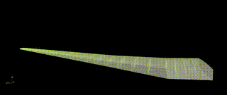
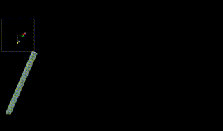
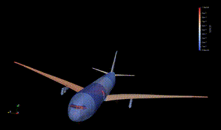

# Finite Element models 4 Intrinsic Nonlinear Aeroelastics in JAX [FENIAX]

FENIAX is an aeroelastic toolbox  written and parallelized in Python, which acts as a post-processor of commercial software such as MSC Nastran. 
Arbitrary FE models built for linear aeroelastic analysis are enhanced with geometric nonlinear effects, flight dynamics and linearized state-space solutions about nonlinear equilibrium.


## Installation

- Currently the code has been tested and is developed in Linux and MacOS.
- A minimum installation into the current environment is possible by navigating to the main directory and
```
pip install .
```

- However developer mode is recommended and also installing the full set of packages which include testing and visualisation capabilities:

```
pip install -e .[all]
```

- see setup.py file for the options available. Python 3.9+ is required but 3.11+ is recommended. 
Although it is not necessary, If conda is being used as package manager, one can make a specific environment as,

```
conda create -n feniax python=3.11
conda activate fem4inas
```

- If pytest has been installed, check everything is OK by running the tests: 

```
pytest tests
```

- Thus a typical installation would comprise of these 4 steps:
```
conda create -n feniax.python=3.11
conda activate fem4inas
pip install -e .[all]
pytest tests
```

## Documentation
Available at https://acea15.github.io/FENIAX/
## Simulation Examples

The most relevant examples in the code base are shown here, these and more can be found in the folder `/examples`
They are also part of a large test suite that is integrated into the development using CI/CD.

!!! tip
    Navigate to the code of the various examples, including the simulation input settings and postprocessing of the simulation --exactly as it was used for the articles backing the software.


### Nonlinear structural static results
!!! success
    Validated with MSC Nastran nonlinear solution (sol 400)

[Notebook](./docs/documentation/examples/SailPlane/sailplane_nb.md)

### Wing free dynamics
!!! success
    Validated with MSC Nastran nonlinear solution (sol 400)
	
[Notebook](./docs/documentation/examples/wingSP/wingSP_nb.md)




	
### Free flying structure

[Bio](https://mechanics.stanford.edu/simo)

[Notebook](./docs/documentation/examples/wingSP/wingSP_nb.md)

#### 2D dynamics

#### 3D dynamics


### Industrial Aircraft model
!!! success
    Linear response validated with MSC Nastran linear aeroelastic solution (sol 146)

#### Gust clamped model

[Notebook](./docs/documentation/examples/XRF1/xrf1_nb.md)





#### Gust trimmed flight

