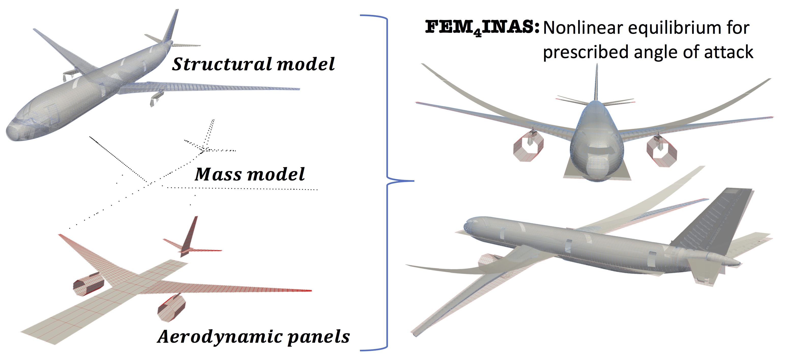

# Finite Element models 4 Intrinsic Nonlinear Aeroelastics in JAX [FENIAX]

FEM4INAS is an aeroelastic toolbox  written and parallelized in Python, which acts as a post-processor of commercial software such as MSC Nastran. 
Arbitrary FE models built for linear aeroelastic analysis are enhanced with geometric nonlinear effects, flight dynamics and linearized state-space solutions about nonlinear equilibrium.



## Installation

- Currently the code has been tested and is developed in Linux and MacOS.
- A minimum installation into the current environment is possible by navigating to the main directory and
```
pip install .
```

- However developer mode is recommended and also installing the full set of packages which include testing and visualisation capabilities:

```
pip install -e .[all]
```

- see setup.py file for the options available. Python 3.9+ is required but 3.11+ is recommended. 
Although it is not necessary, If conda is being used as package manager, one can make a specific environment as,

```
conda create -n fem4inas python=3.11
conda activate fem4inas
```

- If pytest has been installed, check everything is OK by running the tests: 

```
pytest tests
```

- Thus a typical installation would comprise of these 4 steps:
```
conda create -n fem4inas python=3.11
conda activate fem4inas
pip install -e .[all]
pytest tests
```

## Examples

The folder examples contains various instances with models, input files and postprocessing of the results. See each README.org for for more info.

