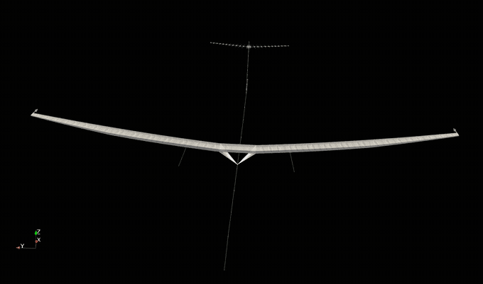
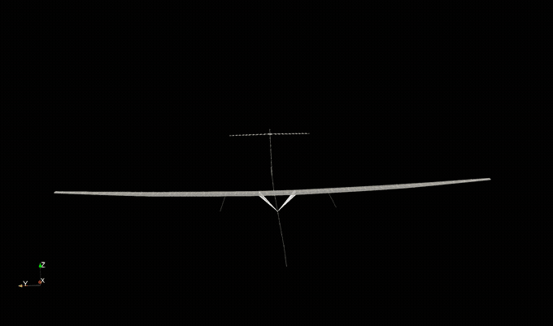

# Finite Element models 4 Nonlinear Intrinsic Aeroelastics in JAX [FENIAX]

FENIAX is an aeroelastic toolbox  written in Python using JAX. It acts as a post-processor of commercial software such as MSC Nastran. 

Some of the key features of the software are:
- Arbitrary FE models built for linear aeroelastic analysis are enhanced with geometric nonlinear effects, flight dynamics and linearized state-space solutions about nonlinear equilibrium.
- Leveraging on the numerical library JAX and optimised algorithms, a high performance is achieved that leads to simulation times comparable to the linear counterparts on conventional platforms.
- The software runs on modern hardware architectures such as GPUs in a addition to standard CPUs.
- Algorithm differentiation (AD) of the aeroelastic response is available via JAX primitives. 
- Concurrent simulations for multiple load cases have been developed.

## Installation

- Currently the code has been tested and is developed in Linux and MacOS. It can be run from Windows using the Windows Subsystem for Linux (WSL).  
- For advanced installation options, please go to [Getting Started](https://acea15.github.io/FENIAX/getting_started/). A minimum installation into the current environment is possible by navigating to the main directory and
```
pip install .
```

- However, developer mode is recommended, which also installs the full set of packages, including testing and visualisation capabilities:

```
pip install -e .[all]
```

- see pyproject.toml file for the options available. Python 3.10+ is required.

- To install with GPU support install jax first:
```
pip install -U "jax[cuda12]"
pip install -e ".[all]"
```

## Documentation
Available at https://acea15.github.io/FENIAX/

## Examples
The most relevant examples in the code base are shown here, these and more can be found in the folder `/examples`
They are also part of a large test suite that is integrated into the development using CI/CD.

!!! tip
    Navigate to the code of the various examples, including the simulation input settings and postprocessing of the simulation --exactly as it was used for the articles backing the software. See [examples](https://acea15.github.io/FENIAX/examples/) for further details.


### Nonlinear structural static results
!!! success
    - Validated with MSC Nastran nonlinear solution (sol 400)
	- AD differentiation of the response verified against finite-differences
	

[Notebook](./docs/documentation/examples/SailPlane/sailplane_nb.md)


!!! note
    Take a liner FE model of arbitrary complexity from your favourite FE solver, and turn it into a fully geometrically nonlinear model. You just need a condensation step into the main load paths and the resulting linear stiffness and mass matrices.  
### Wing free dynamics
!!! success
    - Validated with MSC Nastran nonlinear solution (sol 400)
    - Runs over x100 faster than Nastran 
    - AD differentiation of the response verified against finite-differences

[Notebook](./docs/documentation/examples/wingSP/wingSP_nb.md)


	
### Free flying structure
This example first appeared in the work of Juan Carlos Simo (see [Bio](https://mechanics.stanford.edu/simo))
, a pioneer in the field of computational structural mechanics and the 

[Notebook](./docs/documentation/examples/wingSP/wingSP_nb.md)

#### 2D dynamics

#### 3D dynamics


### Concurrent aeroelastic simulations on ultra-high aspect ratio aircraft
!!! success
	- Nonlinear aeroelastic response in our solvers takes similar times or less to the linear Nastran solution!! 
	- Concurrent simulations for various loading settings achieve unparalleled computational times.
	- CPU VS GPU benchmarks available.

#### Wing-tip static loading

- Extremely large deformations
- Validation of concurrent solution
- 300 modes in the solution, 8 different loading scenarios running in parallel each with 11 substeps, 24 seconds in total on A100 GPU




#### Aeroelastic equilibrium for varying AoA

- Nonlinear effects: follower aerodynamic forces, geometric stiffening, wing shortening.
- Steady manoeuvre varying flow conditions and AoA for a total 256 cases in 14 seconds.


#### Dynamic loads at large scale: gust envelopes

- 512 different gust cases run on A100 GPU NVIDIA in 38 seconds!
- Rigid body modes included, rigid/elastic nonlinear couplings accounted for.
- Load envelopes available from the simulation.


