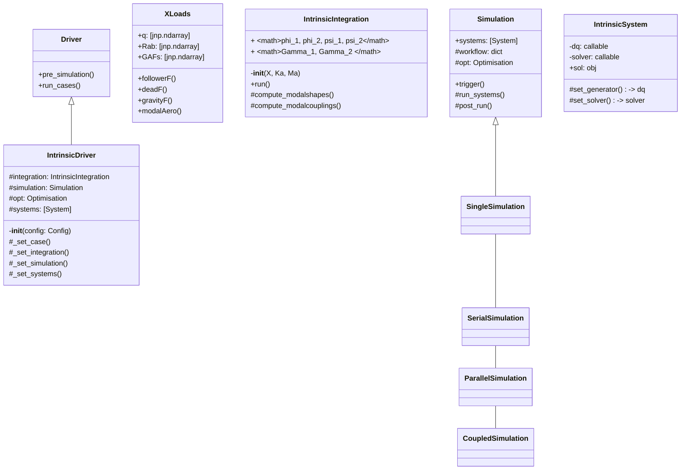

# example

```mermaid
classDiagram
   class Driver {
            +pre_simulation()
            +run_cases()
    }

     class IntrinsicDriver {
             #integration: IntrinsicIntegration
             #simulation: Simulation
             #opt: Optimisation
             #systems: [System]
             -__init__(config: Config)
             #_set_case()
             #_set_integration()
             #_set_simulation()
             #_set_systems()
     }

     class  XLoads {
             +q: [jnp.ndarray]
             +Rab: [jnp.ndarray]
             +GAFs: [jnp.ndarray]
             +followerF()
             +deadF()
             +gravityF()
             +modalAero()
             }

     class IntrinsicIntegration {
                     + <math>phi_1, phi_2, psi_1, psi_2</math>
                     + <math>Gamma_1, Gamma_2 </math>
                     -__init__(X, Ka, Ma)		
                     +run()
                     #compute_modalshapes()
                     #compute_modalcouplings()
     }

     class Simulation {
                     +systems: [System]
                     #workflow: dict
                     #opt: Optimisation
                     +trigger()
                     #run_systems()
                     #post_run()
             }
     class SerialSimulation {
     }
     class ParallelSimulation {
     }
     class SingleSimulation {
     }
     class CoupledSimulation {
     }

     class IntrinsicSystem {
            -dq: callable
            -solver: callable
            +sol: obj
            #set_generator() -> dq
            #set_solver() -> solver

     }
     Driver <|-- IntrinsicDriver
     Simulation <|-- SingleSimulation
     SingleSimulation -- SerialSimulation 
     SerialSimulation -- ParallelSimulation
     ParallelSimulation -- CoupledSimulation					

```
