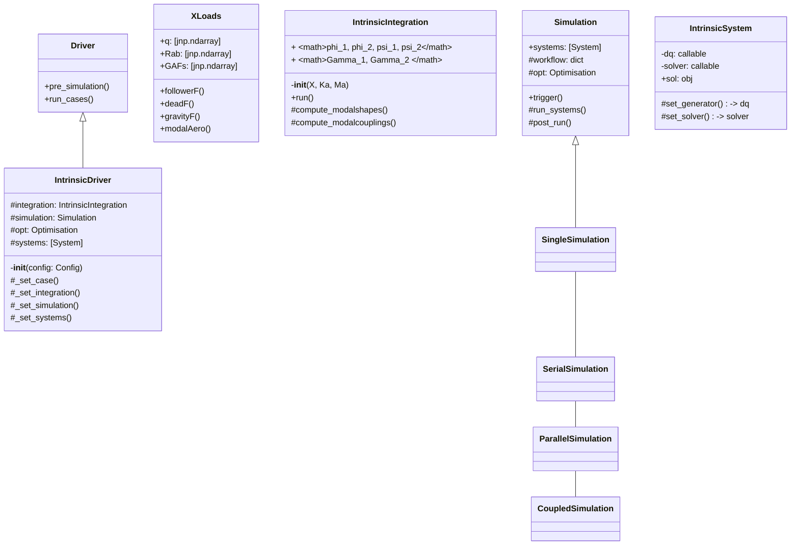
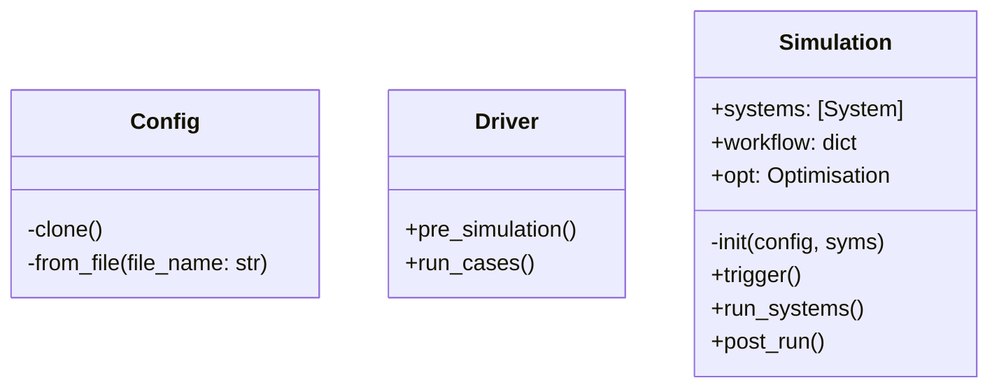

# example

Fig. [[components_architecture]] shows a high-level view of this first version of the software in terms of components. A Configuration component builds the necessary settings for the simulation, including geometric coordinates, load-paths information.
The Configuration is injected into the Driver component that initialises the Simulation component, the Systems and the Solution component, after which it triggers the simulation. The Systems are run as managed by the Simulation component and encapsulate the various equations to be solved (time marching, nonlinear static equilibrium or stability for instance). The solution component acts as a memory-efficient container of the new data to be kept as the solution process advances, and it is responsible for loading (from a previous simulations) and writing solution data too. It is thus passed to every System. 

Fig. [[classes_architecture]] shows a lower view of the abstractions, interfaces between classes and how they interact via their public methods. The inputs to the program may be given via a .yaml file or a python dictionary in memory. The starting point in the main file is the initialisation of the driver corresponding to the mathematical description to be solved (so far only the intrinsic modal is available, Eqs. \eqref{eq3:intrinsic_full_aeroelastic}). The intrinsic driver computes (or loads), as a pre-simulation step, the intrinsic modal shapes and nonlinear tensors from the linear stiffness and mass matrices and the nodal coordinates; then it runs the cases by triggering the simulation class. This class is responsible for managing how the systems are being run (in serial, in parallel, or even in a coupling process between systems). From the configuration settings, the intrinsic system loads the equations (dqs), the external loads in Eqs. \eqref{eq2:sol_qs}, such as point-forces, gravity or modal aerodynamic GAFs. Various libraries can be chosen to either solve the static equations or march in time if the solution is dynamic; importantly, the JAX-based Diffrax library has been integrated and supports ordinary, stochastic and controlled equations, with many solvers and multiple adjoint methods which could be used in an optimization framework. This initial layout of the software is expected to evolve and to be consolidated as the software matures. 

  circle feniax_main
  class Config {
  	-clone()
  	-from_file(file_name: str)
  	}
  	
  abstract Driver {
            +pre_simulation()
            +run_cases()
    }

  abstract class Simulation {
          +systems: [System]
          #workflow: dict[str:str]
          #opt: Optimisation
          -__init__(config.simulation,
          systems, opt, config.simulation)
          +trigger()
          #run_systems()
          #post_run()
  }

  abstract class System {
          +set_ic(q0)
          +solve() -> sol
          +pull_solution() -> qs
  }

  metaclass Sollibs {
          +name()
          +pull_name()
  }
  feniax_main -- Config
  Config -- Driver	
  Driver  *-- Simulation
  Driver  *- System
  System  *- Sollibs
  System ..> Simulation

