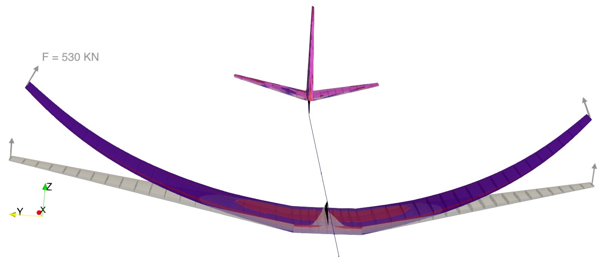

# Sail Plane

Verifying the structural implementation on a clamped configuration.

## Load modules

``` python
import plotly.express as px
import pyNastran.op4.op4 as op4
import matplotlib.pyplot as plt
import pdb
import datetime
import os
import shutil
REMOVE_RESULTS = True
#   for root, dirs, files in os.walk('/path/to/folder'):
#       for f in files:
#           os.unlink(os.path.join(root, f))
#       for d in dirs:
#           shutil.rmtree(os.path.join(root, d))
# 
if os.getcwd().split('/')[-1] != 'results':
    if not os.path.isdir("./figs"):
        os.mkdir("./figs")
    if REMOVE_RESULTS:
        if os.path.isdir("./results"):
            shutil.rmtree("./results")
    if not os.path.isdir("./results"):
        print("***** creating results folder ******")
        os.mkdir("./results")
    os.chdir("./results")
```

``` {#PYTHONMODULES .python}
import pathlib
import pickle
import jax.numpy as jnp
import jax
import pandas as pd
import feniax.preprocessor.configuration as configuration  # import Config, dump_to_yaml
from feniax.preprocessor.inputs import Inputs
import feniax.feniax_main
import feniax.preprocessor.solution as solution
import feniax.unastran.op2reader as op2reader
from tabulate import tabulate
```

## Run cases

``` python

import time

TIMES_DICT = dict()
SOL = dict()
CONFIG = dict()

def run(input1, **kwargs):
    jax.clear_caches()
    label = kwargs.get('label', 'default')
    t1 = time.time()
    config =  configuration.Config(input1)
    sol = feniax.feniax_main.main(input_obj=config)
    t2 = time.time()
    TIMES_DICT[label] = t2 - t1      
    SOL[label] = sol
    CONFIG[label] = config

def save_times():
    pd_times = pd.DataFrame(dict(times=TIMES_DICT.values()),
                            index=TIMES_DICT.keys())
    pd_times.to_csv("./run_times.csv")
```

``` {#SP .python}
SP_folder = feniax.PATH / "../examples/SailPlane"
inp = Inputs()
inp.engine = "intrinsicmodal"
inp.fem.eig_type = "inputs"
inp.fem.connectivity = dict(FuselageFront=['RWingInner',
                                         'LWingInner'],
                            FuselageBack=['BottomTail',
                                          'Fin'],
                            RWingInner=['RWingOuter'],
                            RWingOuter=None,
                            LWingInner=['LWingOuter'],
                            LWingOuter=None,
                            BottomTail=['LHorizontalStabilizer',
                                        'RHorizontalStabilizer'],
                            RHorizontalStabilizer=None,
                            LHorizontalStabilizer=None,
                            Fin=None
                            )

inp.fem.folder = pathlib.Path(SP_folder / 'FEM/')
inp.fem.num_modes = 50
inp.driver.typeof = "intrinsic"
inp.simulation.typeof = "single"
inp.systems.sett.s1.solution = "static"
inp.systems.sett.s1.solver_library = "diffrax"
inp.systems.sett.s1.solver_function = "newton"
inp.systems.sett.s1.solver_settings = dict(rtol=1e-6,
                                           atol=1e-6,
                                           max_steps=50,
                                           norm="linalg_norm",
                                           kappa=0.01)
# inp.systems.sett.s1.solver_library = "scipy"
# inp.systems.sett.s1.solver_function = "root"
# inp.systems.sett.s1.solver_settings = dict(method='hybr',#'krylov',
#                                           tolerance=1e-9)
inp.systems.sett.s1.xloads.follower_forces = True
inp.systems.sett.s1.xloads.follower_points = [[25, 2], [48, 2]]

inp.systems.sett.s1.xloads.x = [0, 1, 2, 3, 4, 5, 6]
inp.systems.sett.s1.xloads.follower_interpolation = [[0.,
                                                      2e5,
                                                      2.5e5,
                                                      3.e5,
                                                      4.e5,
                                                      4.8e5,
                                                      5.3e5],
                                                     [0.,
                                                      2e5,
                                                      2.5e5,
                                                      3.e5,
                                                      4.e5,
                                                      4.8e5,
                                                      5.3e5]
                                                     ]
inp.systems.sett.s1.t = [1, 2, 3, 4, 5, 6]
```

### SP1

``` {#SP1 .python}

SP_folder = feniax.PATH / "../examples/SailPlane"
inp = Inputs()
inp.engine = "intrinsicmodal"
inp.fem.eig_type = "inputs"
inp.fem.connectivity = dict(FuselageFront=['RWingInner',
                                         'LWingInner'],
                            FuselageBack=['BottomTail',
                                          'Fin'],
                            RWingInner=['RWingOuter'],
                            RWingOuter=None,
                            LWingInner=['LWingOuter'],
                            LWingOuter=None,
                            BottomTail=['LHorizontalStabilizer',
                                        'RHorizontalStabilizer'],
                            RHorizontalStabilizer=None,
                            LHorizontalStabilizer=None,
                            Fin=None
                            )

inp.fem.folder = pathlib.Path(SP_folder / 'FEM/')
inp.fem.num_modes = 50
inp.driver.typeof = "intrinsic"
inp.simulation.typeof = "single"
inp.systems.sett.s1.solution = "static"
inp.systems.sett.s1.solver_library = "diffrax"
inp.systems.sett.s1.solver_function = "newton"
inp.systems.sett.s1.solver_settings = dict(rtol=1e-6,
                                           atol=1e-6,
                                           max_steps=50,
                                           norm="linalg_norm",
                                           kappa=0.01)
# inp.systems.sett.s1.solver_library = "scipy"
# inp.systems.sett.s1.solver_function = "root"
# inp.systems.sett.s1.solver_settings = dict(method='hybr',#'krylov',
#                                           tolerance=1e-9)
inp.systems.sett.s1.xloads.follower_forces = True
inp.systems.sett.s1.xloads.follower_points = [[25, 2], [48, 2]]

inp.systems.sett.s1.xloads.x = [0, 1, 2, 3, 4, 5, 6]
inp.systems.sett.s1.xloads.follower_interpolation = [[0.,
                                                      2e5,
                                                      2.5e5,
                                                      3.e5,
                                                      4.e5,
                                                      4.8e5,
                                                      5.3e5],
                                                     [0.,
                                                      2e5,
                                                      2.5e5,
                                                      3.e5,
                                                      4.e5,
                                                      4.8e5,
                                                      5.3e5]
                                                     ]
inp.systems.sett.s1.t = [1, 2, 3, 4, 5, 6]

inp.fem.num_modes = 5
inp.driver.sol_path = pathlib.Path(
    f"./{name}")
run(inp, label=name)
```

### SP2

``` {#SP2 .python}

SP_folder = feniax.PATH / "../examples/SailPlane"
inp = Inputs()
inp.engine = "intrinsicmodal"
inp.fem.eig_type = "inputs"
inp.fem.connectivity = dict(FuselageFront=['RWingInner',
                                         'LWingInner'],
                            FuselageBack=['BottomTail',
                                          'Fin'],
                            RWingInner=['RWingOuter'],
                            RWingOuter=None,
                            LWingInner=['LWingOuter'],
                            LWingOuter=None,
                            BottomTail=['LHorizontalStabilizer',
                                        'RHorizontalStabilizer'],
                            RHorizontalStabilizer=None,
                            LHorizontalStabilizer=None,
                            Fin=None
                            )

inp.fem.folder = pathlib.Path(SP_folder / 'FEM/')
inp.fem.num_modes = 50
inp.driver.typeof = "intrinsic"
inp.simulation.typeof = "single"
inp.systems.sett.s1.solution = "static"
inp.systems.sett.s1.solver_library = "diffrax"
inp.systems.sett.s1.solver_function = "newton"
inp.systems.sett.s1.solver_settings = dict(rtol=1e-6,
                                           atol=1e-6,
                                           max_steps=50,
                                           norm="linalg_norm",
                                           kappa=0.01)
# inp.systems.sett.s1.solver_library = "scipy"
# inp.systems.sett.s1.solver_function = "root"
# inp.systems.sett.s1.solver_settings = dict(method='hybr',#'krylov',
#                                           tolerance=1e-9)
inp.systems.sett.s1.xloads.follower_forces = True
inp.systems.sett.s1.xloads.follower_points = [[25, 2], [48, 2]]

inp.systems.sett.s1.xloads.x = [0, 1, 2, 3, 4, 5, 6]
inp.systems.sett.s1.xloads.follower_interpolation = [[0.,
                                                      2e5,
                                                      2.5e5,
                                                      3.e5,
                                                      4.e5,
                                                      4.8e5,
                                                      5.3e5],
                                                     [0.,
                                                      2e5,
                                                      2.5e5,
                                                      3.e5,
                                                      4.e5,
                                                      4.8e5,
                                                      5.3e5]
                                                     ]
inp.systems.sett.s1.t = [1, 2, 3, 4, 5, 6]

inp.fem.num_modes = 15
inp.driver.sol_path = pathlib.Path(
    f"./{name}")
run(inp, label=name)
```

### SP3

``` {#SP3 .python}

SP_folder = feniax.PATH / "../examples/SailPlane"
inp = Inputs()
inp.engine = "intrinsicmodal"
inp.fem.eig_type = "inputs"
inp.fem.connectivity = dict(FuselageFront=['RWingInner',
                                         'LWingInner'],
                            FuselageBack=['BottomTail',
                                          'Fin'],
                            RWingInner=['RWingOuter'],
                            RWingOuter=None,
                            LWingInner=['LWingOuter'],
                            LWingOuter=None,
                            BottomTail=['LHorizontalStabilizer',
                                        'RHorizontalStabilizer'],
                            RHorizontalStabilizer=None,
                            LHorizontalStabilizer=None,
                            Fin=None
                            )

inp.fem.folder = pathlib.Path(SP_folder / 'FEM/')
inp.fem.num_modes = 50
inp.driver.typeof = "intrinsic"
inp.simulation.typeof = "single"
inp.systems.sett.s1.solution = "static"
inp.systems.sett.s1.solver_library = "diffrax"
inp.systems.sett.s1.solver_function = "newton"
inp.systems.sett.s1.solver_settings = dict(rtol=1e-6,
                                           atol=1e-6,
                                           max_steps=50,
                                           norm="linalg_norm",
                                           kappa=0.01)
# inp.systems.sett.s1.solver_library = "scipy"
# inp.systems.sett.s1.solver_function = "root"
# inp.systems.sett.s1.solver_settings = dict(method='hybr',#'krylov',
#                                           tolerance=1e-9)
inp.systems.sett.s1.xloads.follower_forces = True
inp.systems.sett.s1.xloads.follower_points = [[25, 2], [48, 2]]

inp.systems.sett.s1.xloads.x = [0, 1, 2, 3, 4, 5, 6]
inp.systems.sett.s1.xloads.follower_interpolation = [[0.,
                                                      2e5,
                                                      2.5e5,
                                                      3.e5,
                                                      4.e5,
                                                      4.8e5,
                                                      5.3e5],
                                                     [0.,
                                                      2e5,
                                                      2.5e5,
                                                      3.e5,
                                                      4.e5,
                                                      4.8e5,
                                                      5.3e5]
                                                     ]
inp.systems.sett.s1.t = [1, 2, 3, 4, 5, 6]

inp.fem.num_modes = 30
inp.driver.sol_path = pathlib.Path(
    f"./{name}")
run(inp, label=name)
```

### SP4

``` {#SP4 .python}

SP_folder = feniax.PATH / "../examples/SailPlane"
inp = Inputs()
inp.engine = "intrinsicmodal"
inp.fem.eig_type = "inputs"
inp.fem.connectivity = dict(FuselageFront=['RWingInner',
                                         'LWingInner'],
                            FuselageBack=['BottomTail',
                                          'Fin'],
                            RWingInner=['RWingOuter'],
                            RWingOuter=None,
                            LWingInner=['LWingOuter'],
                            LWingOuter=None,
                            BottomTail=['LHorizontalStabilizer',
                                        'RHorizontalStabilizer'],
                            RHorizontalStabilizer=None,
                            LHorizontalStabilizer=None,
                            Fin=None
                            )

inp.fem.folder = pathlib.Path(SP_folder / 'FEM/')
inp.fem.num_modes = 50
inp.driver.typeof = "intrinsic"
inp.simulation.typeof = "single"
inp.systems.sett.s1.solution = "static"
inp.systems.sett.s1.solver_library = "diffrax"
inp.systems.sett.s1.solver_function = "newton"
inp.systems.sett.s1.solver_settings = dict(rtol=1e-6,
                                           atol=1e-6,
                                           max_steps=50,
                                           norm="linalg_norm",
                                           kappa=0.01)
# inp.systems.sett.s1.solver_library = "scipy"
# inp.systems.sett.s1.solver_function = "root"
# inp.systems.sett.s1.solver_settings = dict(method='hybr',#'krylov',
#                                           tolerance=1e-9)
inp.systems.sett.s1.xloads.follower_forces = True
inp.systems.sett.s1.xloads.follower_points = [[25, 2], [48, 2]]

inp.systems.sett.s1.xloads.x = [0, 1, 2, 3, 4, 5, 6]
inp.systems.sett.s1.xloads.follower_interpolation = [[0.,
                                                      2e5,
                                                      2.5e5,
                                                      3.e5,
                                                      4.e5,
                                                      4.8e5,
                                                      5.3e5],
                                                     [0.,
                                                      2e5,
                                                      2.5e5,
                                                      3.e5,
                                                      4.e5,
                                                      4.8e5,
                                                      5.3e5]
                                                     ]
inp.systems.sett.s1.t = [1, 2, 3, 4, 5, 6]

inp.fem.num_modes = 50
inp.driver.sol_path = pathlib.Path(
    f"./{name}")
run(inp, label=name)
```

### SP5

``` {#SP5 .python}

SP_folder = feniax.PATH / "../examples/SailPlane"
inp = Inputs()
inp.engine = "intrinsicmodal"
inp.fem.eig_type = "inputs"
inp.fem.connectivity = dict(FuselageFront=['RWingInner',
                                         'LWingInner'],
                            FuselageBack=['BottomTail',
                                          'Fin'],
                            RWingInner=['RWingOuter'],
                            RWingOuter=None,
                            LWingInner=['LWingOuter'],
                            LWingOuter=None,
                            BottomTail=['LHorizontalStabilizer',
                                        'RHorizontalStabilizer'],
                            RHorizontalStabilizer=None,
                            LHorizontalStabilizer=None,
                            Fin=None
                            )

inp.fem.folder = pathlib.Path(SP_folder / 'FEM/')
inp.fem.num_modes = 50
inp.driver.typeof = "intrinsic"
inp.simulation.typeof = "single"
inp.systems.sett.s1.solution = "static"
inp.systems.sett.s1.solver_library = "diffrax"
inp.systems.sett.s1.solver_function = "newton"
inp.systems.sett.s1.solver_settings = dict(rtol=1e-6,
                                           atol=1e-6,
                                           max_steps=50,
                                           norm="linalg_norm",
                                           kappa=0.01)
# inp.systems.sett.s1.solver_library = "scipy"
# inp.systems.sett.s1.solver_function = "root"
# inp.systems.sett.s1.solver_settings = dict(method='hybr',#'krylov',
#                                           tolerance=1e-9)
inp.systems.sett.s1.xloads.follower_forces = True
inp.systems.sett.s1.xloads.follower_points = [[25, 2], [48, 2]]

inp.systems.sett.s1.xloads.x = [0, 1, 2, 3, 4, 5, 6]
inp.systems.sett.s1.xloads.follower_interpolation = [[0.,
                                                      2e5,
                                                      2.5e5,
                                                      3.e5,
                                                      4.e5,
                                                      4.8e5,
                                                      5.3e5],
                                                     [0.,
                                                      2e5,
                                                      2.5e5,
                                                      3.e5,
                                                      4.e5,
                                                      4.8e5,
                                                      5.3e5]
                                                     ]
inp.systems.sett.s1.t = [1, 2, 3, 4, 5, 6]

inp.fem.num_modes = 100
inp.driver.sol_path = pathlib.Path(
    f"./{name}")
run(inp, label=name)
```

``` python
save_times()
```

## Postprocessing

### Plotting functions

``` python
print(f"Format for figures: {figfmt}")
def fig_out(name, figformat=figfmt, update_layout=None):
    def inner_decorator(func):
        def inner(*args, **kwargs):
            fig = func(*args, **kwargs)
            if update_layout is not None:
                fig.update_layout(**update_layout)
            fig.show()
            figname = f"figs/{name}.{figformat}"
            fig.write_image(f"../{figname}", scale=6)
            return fig, figname
        return inner
    return inner_decorator


def fig_background(func):

    def inner(*args, **kwargs):
        fig = func(*args, **kwargs)
        # if fig.data[0].showlegend is None:
        #     showlegend = True
        # else:
        #     showlegend = fig.data[0].showlegend

        fig.update_xaxes(
                       titlefont=dict(size=20),
                       tickfont = dict(size=20),
                       mirror=True,
                       ticks='outside',
                       showline=True,
                       linecolor='black',
            #zeroline=True,
        #zerolinewidth=2,
            #zerolinecolor='LightPink',
                       gridcolor='lightgrey')
        fig.update_yaxes(tickfont = dict(size=20),
                       titlefont=dict(size=20),
                       zeroline=True,
                       mirror=True,
                       ticks='outside',
                       showline=True,
                       linecolor='black',
                       gridcolor='lightgrey')
        fig.update_layout(plot_bgcolor='white',
                          yaxis=dict(zerolinecolor='lightgrey'),
                          showlegend=True, #showlegend,
                          margin=dict(
                              autoexpand=True,
                              l=0,
                              r=0,
                              t=2,
                              b=0
                          ))
        return fig
    return inner
```

``` python

def fn_spError(sol_list, config, print_info=True):

    sol_sp= [solution.IntrinsicReader(f"./SP{i}") for i in range(1,6)]
    err = {f"M{i}_L{j}": 0. for i in range(1,6) for j in range(6)}
    for li in range(6): # loads
      for mi in range(1,6):  # modes
        count = 0
        r_spn = []
        r_sp = []
        for index, row in config.fem.df_grid.iterrows():
          r_spn.append(u_sp[li, row.fe_order,:3] + config.fem.X[index])
          r_sp.append(sol_sp[mi - 1].data.staticsystem_s1.ra[li,:,index])
          # print(f"nas = {r_spn}  ,  {r_sp}")
          # count += 1
        r_spn = jnp.array(r_spn)
        r_sp = jnp.array(r_sp)        
        err[f"M{mi}_L{li}"] += jnp.linalg.norm(r_spn - r_sp) #/ jnp.linalg.norm(r_spn)
        err[f"M{mi}_L{li}"] /= len(r_sp)
        if print_info:
            print(f"**** LOAD: {li}, NumModes: {mi} ****")
            print(err[f"M{mi}_L{li}"])
    return err

def fn_spWingsection(sol_list, config):

    sol_sp= [solution.IntrinsicReader(f"./SP{i}") for i in range(1,6)]
    r_spn = []
    r_spnl = []
    r_sp = []
    for li in range(6): # loads
      for mi in [4]:#range(1,6):  # modes
        r_spni = []
        r_spnli = []
        r_spi = []
        r_sp0 = []
        for index, row in config.fem.df_grid.iterrows():
          if row.fe_order in list(range(20)):
            r_sp0.append(config.fem.X[index])  
            r_spni.append(u_sp[li, row.fe_order,:3] + config.fem.X[index])
            r_spnli.append(u_spl[li, row.fe_order,:3] + config.fem.X[index])
            r_spi.append(sol_sp[mi - 1].data.staticsystem_s1.ra[li,:,index])
          # print(f"nas = {r_spn}  ,  {r_sp}")
          # count += 1

        r_spn.append(jnp.array(r_spni))
        r_spnl.append(jnp.array(r_spnli))
        r_sp.append(jnp.array(r_spi))
    r_sp0 = jnp.array(r_sp0)
    return r_sp0, r_sp, r_spn, r_spnl

@fig_background
def plot_spWingsection(r0, r, rn, rnl):
    fig = None
    # colors=["darkgrey", "darkgreen",
    #         "blue", "magenta", "orange", "black"]
    # dash = ['dash', 'dot', 'dashdot']
    modes = [5, 15, 30, 50, 100]
    for li in range(6):
      if li == 0:   
          fig = uplotly.lines2d((r[li][:,0]**2 + r[li][:,1]**2)**0.5, r[li][:,2]-r0[:,2], fig,
                                dict(name=f"NMROM",
                                     line=dict(color="blue",
                                               dash="solid")
                                     ),
                                  dict())
          fig = uplotly.lines2d((rn[li][:,0]**2 + rn[li][:,1]**2)**0.5, rn[li][:,2]-r0[:,2], fig,
                                dict(name=f"FullFE-NL",
                                     line=dict(color="black",
                                               dash="dash")
                                     ),
                                dict())
          fig = uplotly.lines2d((rnl[li][:,0]**2 + rnl[li][:,1]**2)**0.5, rnl[li][:,2]-r0[:,2], fig,
                                dict(name=f"FullFE-Lin",
                                     line=dict(color="orange",
                                               dash="solid")
                                     ),
                                dict())

      else:
          fig = uplotly.lines2d((r[li][:,0]**2 + r[li][:,1]**2)**0.5, r[li][:,2]-r0[:,2], fig,
                                dict(showlegend=False,
                                     line=dict(color="blue",
                                               dash="solid")
                                     ),
                                  dict())
          fig = uplotly.lines2d((rn[li][:,0]**2 + rn[li][:,1]**2)**0.5, rn[li][:,2]-r0[:,2], fig,
                                dict(showlegend=False,
                                     line=dict(color="black",
                                               dash="dash")
                                     ),
                                dict())
          fig = uplotly.lines2d((rnl[li][:,0]**2 + rnl[li][:,1]**2)**0.5, rnl[li][:,2]-r0[:,2], fig,
                                dict(showlegend=False,
                                     line=dict(color="orange",
                                               dash="solid")
                                     ),
                                dict())            
    fig.update_yaxes(title=r'$\large u_z [m]$')
    fig.update_xaxes(title=r'$\large S [m]$', range=[6.81,36])
    fig.update_layout(legend=dict(x=0.6, y=0.95),
                      font=dict(size=20))
    # fig = uplotly.lines2d((rnl[:,0]**2 + rnl[:,1]**2)**0.5, rnl[:,2], fig,
    #                       dict(name=f"NASTRAN-101",
    #                            line=dict(color="grey",
    #                                      dash="solid")
    #                                  ),
    #                             dict())
    return fig

@fig_background
def fn_spPloterror(error):

    loads = [200, 250, 300, 400, 480, 530]
    num_modes = [5, 15, 30, 50, 100]
    e250 = jnp.array([error[f'M{i}_L1'] for i in range(1,6)])
    e400 = jnp.array([error[f'M{i}_L3'] for i in range(1,6)])
    e530 = jnp.array([error[f'M{i}_L5'] for i in range(1,6)])
    fig = None
    fig = uplotly.lines2d(num_modes, e250 , fig,
                              dict(name="F = 250 KN",
                                   line=dict(color="red")
                                   ),
                              dict())
    fig = uplotly.lines2d(num_modes, e400, fig,
                              dict(name="F = 400 KN",
                                   line=dict(color="green", dash="dash")
                                   ),
                              dict())
    fig = uplotly.lines2d(num_modes, e530, fig,
                              dict(name="F = 530 KN",
                                   line=dict(color="black", dash="dot")
                                   ),
                              dict())
    fig.update_xaxes(title= {'font': {'size': 20}, 'text': 'Number of modes'})#title="Number of modes",title_font=dict(size=20))
    fig.update_yaxes(title=r"$\Large \epsilon$",type="log", # tickformat= '.1r',
                     tickfont = dict(size=12), exponentformat="power",
                     #dtick=0.2,
                     #tickvals=[2e-2, 1e-2, 7e-3,5e-3,3e-3, 2e-3, 1e-3,7e-4, 5e-4,3e-4, 2e-4, 1e-4, 7e-5, 5e-5]
                     )
    #fig.update_layout(height=650)
    fig.update_layout(legend=dict(x=0.7, y=0.95), font=dict(size=20))

    return fig

@fig_background
def fn_spPloterror3D(error, error3d):

    loads = [200, 250, 300, 400, 480, 530]
    fig = None
    if error is not None:
      fig = uplotly.lines2d(loads, error, fig,
                                dict(name="Error ASET",
                                     line=dict(color="red"),
                                     marker=dict(symbol="square")
                                     ),
                                dict())

    fig = uplotly.lines2d(loads, error3d, fig,
                              dict(name="Error full 3D",
                                   line=dict(color="green")
                                   ),
                              dict())

    fig.update_yaxes(type="log", tickformat= '.0e')
    fig.update_layout(#height=700,
                      # showlegend=False,
                      #legend=dict(x=0.7, y=0.95),
                      xaxis_title='Loading [KN]',
                      yaxis_title=r'$\Large \epsilon$')

    return fig

@fig_background
def plot_spAD(rn, r0):

    loads = [200, 250, 300, 400, 480, 530]
    fig = None
    x = list(range(1,7))
    y = [rn[i-1][-1, 2] - r0[-1,2] for i in x]
    fig = uplotly.lines2d(x, y, fig,
                                dict(#name="Error ASET",
                                     #line=dict(color="red"),
                                     #marker=dict(symbol="square")
                                     ),
                                dict())


    #fig.update_yaxes(type="log", tickformat= '.0e')
    fig.update_layout(#height=700,
                      showlegend=False,
                      xaxis_title=r'$\Large{\tau}$',
                      yaxis_title='Uz [m]'
    )

    return fig
```

### Load Nastran data

``` python

import pathlib
import pickle
import jax.numpy as jnp
import jax
import pandas as pd
import feniax.preprocessor.configuration as configuration  # import Config, dump_to_yaml
from feniax.preprocessor.inputs import Inputs
import feniax.feniax_main
import feniax.preprocessor.solution as solution
import feniax.unastran.op2reader as op2reader
from tabulate import tabulate


examples_path = pathlib.Path("../../../../examples")
####### SailPlane ###########
SP_folder = examples_path / "SailPlane"
#nastran_path = wingSP_folder / "NASTRAN/"

op2model = op2reader.NastranReader(SP_folder / "NASTRAN/static400/run.op2",
                                   SP_folder / "NASTRAN/static400/run.bdf",
                                 static=True)

op2model.readModel()
t_sp, u_sp = op2model.displacements()

op2modell = op2reader.NastranReader(SP_folder / "NASTRAN/static400/run_linear.op2",
                                   SP_folder / "NASTRAN/static400/run_linear.bdf",
                                 static=True)

op2modell.readModel()
t_spl, u_spl = op2modell.displacements()
sp_error3d = jnp.load(examples_path/ "SailPlane/sp_err.npy")
```

### Structural verification of a representative configuration

1.  Geometrically nonlinear static response

    The static equilibrium of the aircraft under prescribed loads is
    first studied with follower loads normal to the wing applied at the
    tip of each wing (nodes 25 and 48). The response for an increasing
    load stepping of 200, 300, 400, 480 and 530 KN is computed. The
    snippet of the inputs and simulation call are given in Listing
    `\ref{code:static}`{=latex}.

    ```{=latex}
    \begin{listing}[!ht]
    \begin{minted}[frame=single]{python}
    import feniax.preprocessor.configuration as configuration
    from feniax.preprocessor.inputs import Inputs
    import feniax.feniax_main
    inp = Inputs()
    inp.fem.folder = "./FEM/"
    inp.fem.num_modes = 50
    inp.systems.sett.s1.solution = "static"
    inp.systems.sett.s1.solver_library = "diffrax"
    inp.systems.sett.s1.solver_function = "newton"
    inp.systems.sett.s1.solver_settings = dict(rtol=1e-6,
                                               atol=1e-6,
                                               max_steps=50,
                                               norm="linalg_norm")
    inp.systems.sett.s1.xloads.follower_forces = True
    inp.systems.sett.s1.xloads.follower_points = [[25, 2], [48, 2]]
    inp.systems.sett.s1.xloads.x = [0, 1, 2, 3, 4, 5, 6]
    inp.systems.sett.s1.xloads.follower_interpolation =
    [[0., 2e5, 2.5e5, 3.e5, 4.e5, 4.8e5, 5.3e5],
    [0., 2e5, 2.5e5, 3.e5, 4.e5, 4.8e5, 5.3e5]]
    inp.systems.sett.s1.t = [1, 2, 3, 4, 5, 6]
    config =  configuration.Config(inp)
    sol = feniax.feniax_main.main(input_obj=config)
    \end{minted}
    \caption{FENIAX inputs for structural static simulation}
    \label{code:static}
    \end{listing}
    ```
    Nonlinear static simulations on the original full model (before
    condensation) are also carried out in MSC Nastran and are included.
    The interpolation elements in the full FE solver are used to output
    the displacements at the condensation nodes for direct comparison
    with the NMROM results. Geometric nonlinearities are better
    illustrated by representing a sectional view of the wing as in Fig.
    [1](#fig:SPWingsection), where deformations in the z-direction
    versus the metric $S = \sqrt{x^2+y^2}$ are shown. MSC Nastran linear
    solutions (Solution 101) are also included to appreciate more
    clearly the shortening and follower force effects in the nonlinear
    computations.

    ``` {#SPWingsection .python}
    import feniax.preprocessor.configuration as configuration
    config = configuration.Config.from_file("SP1/config.yaml")
    sol_sp= [solution.IntrinsicReader(f"./SP{i}") for i in range(1,6)]
    r_sp0, r_sp, r_spn, r_spnl = fn_spWingsection(sol_sp, config)
    fig, figname = fig_out(name)(plot_spWingsection)(r_sp0, r_sp, r_spn, r_spnl)
    figname
    ```

    ```{=org}
    #+name: fig:SPWingsection
    ```
    ```{=org}
    #+caption: Static geometrically-nonlinear effects on the aircraft main wing
    ```
    ```{=org}
    #+attr_latex: :width 0.5\textwidth
    ```
    ```{=org}
    #+results: SPWingsection
    ```
    [file:]()

    The tolerance in the Newton solver was set to $10^{-6}$ in all
    cases. A convergence analysis with the number of modes in the
    solution is presented in Fig. [1](#SPstatic_convergence). 5, 15, 30,
    50, 100 modes are used to build the corresponding NMROMs. The error
    metric is defined as the $\ell^2$ norm divided by the total number
    of nodes (only the condenses ones in this case):
    $\epsilon = ||u_{NMROM} - u_{NASTRAN}||/N_{nodes}$. It can be seen
    the solution with 50 modes already achieves a very good solution
    even for the largest load which produces a 25.6$\%$ tip deformation
    of the wing semi-span, $b = 28.8$ m. The displacement difference
    with the full FE solution at the tip in this case is less than
    0.2$\%$.

    ``` {#SPerror .python}

    config = configuration.Config.from_file("SP1/config.yaml")
    sol_sp= [solution.IntrinsicReader(f"./SP{i}") for i in range(1,6)]
    sp_error = fn_spError(sol_sp, config, print_info=True)
    fig, figname = fig_out(name)(fn_spPloterror)(sp_error)
    figname
    ```

    {#SPstatic_convergence}

    The 3D structural response has been reconstructed using the approach
    in Fig. . The nodes connected by the interpolation elements (RBE3s)
    to the ASET solution are reconstructed first and subsequently a
    model with RBFs kernels is used to extrapolate to the rest of the
    nodes in the full FE. A very good agreement is found against the
    geometrically-nonlinear Nastran solution (SOL 400). Fig.
    [2](#SPstatic_3D) shows the overlap in the Nastran solution (in red)
    and the NMROM (in blue) for the 530 KN loading.

    ```{=org}
    #+name: SPstatic_3D
    ```
    ```{=org}
    #+caption: Static 3D solution for a solution with 50 modes and 530 KN loading (Full NASTRAN solution in red versus the NMROM in blue).
    ```
    ```{=org}
    #+attr_latex: :width 0.7\textwidth
    ```
    
     The error metric of this 3D
    solution is also assessed in Fig. [2](#fig:SPerror3D), for the
    solution with 50 modes. The discrepancy metric is of the same order
    than the previously shown at the reduction points. This conveys an
    important point, that there is no significant accuracy loss in the
    process of reconstructing the 3D solution.

    ``` {#SPerror3D .python}
    sp_error1D = [sp_error[f'M4_L{i}'] for i in range(6)]
    # fig, figname = fig_out(name)(fn_spPloterror3D)(sp_error1D, sp_error3d)
    fig, figname = fig_out(name,update_layout=dict(showlegend=False))(fn_spPloterror3D)(None, sp_error3d)
    figname
    ```

    {#fig:SPerror3D}

    Next we compare the computational times for the various solutions
    presented in this section in Table [1](#table:SP_times).
    Computations of the six load steps in Fig. [1](#fig:SPWingsection)
    are included in the assessment. A near 50 times speed-up is achieved
    with our solvers compared to Nastran nonlinear solution, which is
    one of the main strengths of the proposed method. As expected, the
    linear static solution in Nastran is the fastest of the results,
    given it only entails solving a linear, very sparse system of
    equations.

    ``` {#SP_times .python}
    dfruns = pd.read_csv('./run_times.csv',index_col=0).transpose()
    values = ["Time [s]"]
    values += [', '.join([str(round(dfruns[f'SP{i+1}'].iloc[0], 2)) for i in range(5)])]
    values += [5*60 + 45]
    values += [1.02]
    header = ["NMROM (modes: 5, 15, 30, 50, 100)"]
    header += ["NASTRAN 400"]
    header += ["NASTRAN 101"]
    # df_sp = pd.DataFrame(dict(times=TIMES_DICT.values()),
    #                         index=TIMES_DICT.keys())

    # df_ = results_df['shift_conm2sLM25']
    # df_ = df_.rename(columns={"xlabel": "%Chord"})
    tabulate([values], headers=header, tablefmt='orgtbl')
    ```

                   NMROM (modes: 5, 15, 30, 50, 100)   NASTRAN 400   NASTRAN 101
      ------------ ----------------------------------- ------------- -------------
      Time \[s\]   6.7, 6.63, 6.79, 7.06, 9.55         345           1.02

      : Computational times static solution

2.  Differentiation of static response

    The AD for the static solvers is first verified as follows: the load
    stepping shown above becomes a pseudo-time interpolation load such
    that a variable $\tau$ controls the amount of loading and we look at
    the variation of the wing-tip displacement as a function of this
    $\tau$. If
    $f(\tau=[1, 2, 3, 4, 5, 6]) = [200, 250, 300, 400, 480, 530]$ KN,
    with a linear interpolation between points, the derivative of the
    z-component of the tip of the wing displacement is computed at
    $\tau= 1.5, 3.5, 5.5 $, as show in Fig. [3](#fig:sp_ad) where the
    $y$-axis is the tip displacement, $\tau$ is in the $x$-axis and the
    big red circles the points where the derivatives are computed
    (coincident to the graph slope at those points).

    ``` {#SP_AD .python}
    fig, figname = fig_out(name)(plot_spAD)(r_sp, r_sp0)
    #figname
    ```

    ```{=org}
    #+name: fig:sp_ad
    ```
    ```{=org}
    #+caption: Static tip displacement with pseudo-time stepping load
    ```
    ```{=org}
    #+attr_latex: :width 0.5\textwidth
    ```
    <file:figs_ext/sp_ad.pdf> Table [2](#table:SP_AD) shows a very good
    agreement against finite-differences (FD) with an epsilon of
    $10^{-3}$. Note how the derivative at each of the marked points
    corresponds approximately to the slope in the graph at those very
    points, which varies as the load steps are not of equal length. And
    the biggest slope occurs precisely in between $\tau$ of 4 and 5 when
    the prescribed loading undergoes the biggest change from 300 to 400
    KN.
```{=md}
      $\tau$   $f(\tau)$ \[m\]   $f'(\tau)$ (AD)   $f'(\tau)$ (FD)
      -------- ----------------- ----------------- -----------------
      1.5      2.81              0.700             0.700
      3.5      4.527             1.344             1.344
      5.5      6.538             0.623             0.623
```
      : AD verification structural static problem
