# Table of Contents

1.  [Load modules](#org536bf11)
2.  [Run models](#org7edee0d)
    1.  [ArgyrisBeam](#org21d97f3)
        1.  [Run](#org21c85dd)
        2.  [Plot](#org57465e6)
    2.  [Simo45Beam](#orga792100)
        1.  [Follower forces](#orga12e3b2)
        2.  [Dead forces](#org6e95d63)
    3.  [wingSP](#org7e0aa03)
        1.  [Run](#org94f0670)
        2.  [Plot](#orgbd55218)
    4.  [XRF1](#orgb367b05)
        1.  [0](#org57a087a)
        2.  [1](#orgf5f1768)
        3.  [2](#org4d4aa4e)
        4.  [3](#orgaacea69)
        5.  [4](#orgf71ba00)
        6.  [5](#orga52a234)
        7.  [data analysis](#orgfad2e7e)
3.  [Run UML diagrams](#orgcf77120)
4.  [Introduction](#org32af014)
5.  [Theory](#org1762d58)
    1.  [Airframe idealisation](#org0c47902)
    2.  [Nonlinear aeroelastic system](#orgb61807d)
6.  [Computational implementation](#orgf4c56f2)
    1.  [Software design](#orgf2b8e55)
7.  [Examples](#org6694b25)
    1.  [Canonical cases](#orgc48d6ae)
        1.  [Beams static response](#org4c7769f)
        2.  [Free vibrations of thin-walled cantilever](#orgb4766b8)
    2.  [Structural verification of a representative configuration](#org2a14aed)
        1.  [Geometrically nonlinear static response](#org38c74c8)
        2.  [Large-amplitude nonlinear dynamics](#orgdd82c9a)
    3.  [Dynamic loads on an industrial configuration](#org829e82b)
8.  [Conclusions](#orgff9fe8c)

This paper presents a novel aeroelastic framework that has been rebuilt for performance and robustness.
Leveraging on the numerical library JAX, a highly vectorised codebase is written that is capable of nonlinear, time-domain computations and achieves two orders of magnitude accelerations compare to its predecessor. This brings the calculations to run close to if not in real-time, thus opening new possibilities for aircraft aeroelastic analysis which have traditionally been constrained to either linear, frequency domain solutions, or to their nonlinear counterparts but with a narrower scope.   
Moreover, the approach seamlessly integrates with conventional aeroelastic load packages which facilitates the analysis of complex aircraft configurations.
An extensive verification has been carried out and is presented herein, starting from canonical beam cases up to a full industrial FE model that is assessed for dynamic aeroelastic loads.  

# Load modules

    import plotly.express as px
    import pyNastran.op4.op4 as op4
    import matplotlib.pyplot as plt
    import pdb
    import datetime
    import os
    if not os.path.isdir("./results"):
        print("***** creating results folder ******")
        os.mkdir("./results")
    if os.getcwd().split('/')[-1] != 'results':
       os.chdir("./results")

    import pathlib
    import plotly.express as px
    import pickle
    import jax.numpy as jnp
    import pandas as pd
    import numpy as np
    import feniax.preprocessor.configuration as configuration  # import Config, dump_to_yaml
    from feniax.preprocessor.inputs import Inputs
    import feniax.feniax_main
    import feniax.plotools.uplotly as uplotly
    import feniax.plotools.utils as putils
    import feniax.preprocessor.solution as solution
    import feniax.unastran.op2reader as op2reader

# Run models

## ArgyrisBeam

### Run

    import pathlib
    import plotly.express as px
    import pickle
    import jax.numpy as jnp
    import pandas as pd
    import numpy as np
    import feniax.preprocessor.configuration as configuration  # import Config, dump_to_yaml
    from feniax.preprocessor.inputs import Inputs
    import feniax.feniax_main
    import feniax.plotools.uplotly as uplotly
    import feniax.plotools.utils as putils
    import feniax.preprocessor.solution as solution
    import feniax.unastran.op2reader as op2reader
    
    argyrisbeam_folder = feniax.PATH / "../examples/ArgyrisBeam"
    inp = Inputs()
    inp.engine = "intrinsicmodal"
    inp.fem.connectivity = [[]]
    inp.fem.folder = pathlib.Path(f'{argyrisbeam_folder}/FEM/')
    inp.fem.num_modes = 150
    inp.fem.eig_type = "inputs"
    #inp.fem.fe_order_start = 1
    inp.driver.typeof = "intrinsic"
    inp.driver.sol_path= pathlib.Path(
        f"./{name}")
    inp.simulation.typeof = "single"
    inp.systems.sett.s1.solution = "static"
    inp.systems.sett.s1.solver_library = "diffrax"
    inp.systems.sett.s1.solver_function = "newton"
    inp.systems.sett.s1.solver_settings = dict(rtol=1e-6,
                                               atol=1e-6,
                                               max_steps=50,
                                               norm="linalg_norm",
                                               kappa=0.01)
    inp.systems.sett.s1.xloads.follower_forces = True
    inp.systems.sett.s1.xloads.follower_points = [[25, 1]]
    inp.systems.sett.s1.xloads.x = [0, 1, 2, 3, 4, 5, 6, 7]
    inp.systems.sett.s1.xloads.follower_interpolation = [[0.,
                                                         -3.7e3,
                                                         -12.1e3,
                                                         -17.5e3,
                                                         -39.3e3,
                                                         -61.0e3,
                                                         -94.5e3,
                                                         -120e3]
                                                         ]
    inp.systems.sett.s1.t = [1, 2, 3, 4, 5, 6, 7]
    config_argy =  configuration.Config(inp)
    sol_argy = feniax.feniax_main.main(input_obj=config_argy)

### Plot

    import pathlib
    import plotly.express as px
    import pickle
    import jax.numpy as jnp
    import pandas as pd
    import numpy as np
    import feniax.preprocessor.configuration as configuration  # import Config, dump_to_yaml
    from feniax.preprocessor.inputs import Inputs
    import feniax.feniax_main
    import feniax.plotools.uplotly as uplotly
    import feniax.plotools.utils as putils
    import feniax.preprocessor.solution as solution
    import feniax.unastran.op2reader as op2reader
    
    with open (feniax.PATH / "../examples/ArgyrisBeam" / "argyris_new.pickle", 'rb') as fp:
        argypickle  = pickle.load(fp)
    argypickle['c'][10][0] = argypickle['c'][10][0][6:]
    argypickle['c'][10][1] = argypickle['c'][10][1][6:]

    
    figname = "figs/ArgyrisBeam.png"
    sol_argyf = solution.IntrinsicReader("./ArgyrisBeam")
    config_argy =  configuration.Config.from_file("./ArgyrisBeam/config.yaml")
    icomp = putils.IntrinsicStructComponent(config_argy.fem)
    icomp.add_solution(sol_argyf.data.staticsystem_s1.ra)
    colors = px.colors.qualitative.G10
    loads = ["Load: 3.7 KN",
             "Load: 12.1 KN" ,
             "Load: 17.5 KN",
             "Load: 39.3 KN",
             "Load: 61. KN",
             "Load: 94.5 KN",
             "Load: 120 KN"]
    settline = list()
    settmark = list()
    annotations = list()
    annotations.append(dict(#xref='paper',
        x=icomp.map_mra['ref1'][-1,0]+1,
        y=icomp.map_mra['ref1'][-1,1]+3,
        xanchor='right', yanchor='middle',
        text="Load: 0. KN",
        font=dict(family='Arial',
                  size=14),
        showarrow=False))
    
    for i in range(8):
          line_settings=dict(mode="lines+markers",
                             #marker_symbol="218",
                             line=dict(color=colors[i],
                                       width=2.5)
                              )
          marker_settings=dict(mode="markers",
                               marker_symbol="17",
                               marker=dict(color=colors[i+1],
                                           size=10)
                              )
    
          settline.append(line_settings)
          settmark.append(marker_settings)
    
          if i < 7:
              annotations.append(dict(#xref='paper',
                  x=float(icomp.map_mra[i+2][-1,0]-3),
                  y=float(icomp.map_mra[i+2][-1,1]+1),
                  xanchor='right', yanchor='middle',
                  text=loads[i],
                  font=dict(family='Arial',
                            size=14),
                  showarrow=False))
    # plot intrinsic solution
    fig = uplotly.render2d_multi(icomp,
                                   scatter_settings=settline)
    # plot data from Argyris
    fig = uplotly.iterate_lines2d([pi[0] for i, pi in enumerate(argypickle['c']) if (i % 2 ==0)],
                                  [pi[1] for i, pi in enumerate(argypickle['c']) if (i % 2 ==0)],
                                  scatter_settings=settmark,
                                  fig=fig)
    fig.update_layout(margin=dict(
          autoexpand=True,
          l=0,
          r=1.5,
          t=1.5,
          b=0
    ))
    
    fig.update_xaxes(range=[-25, 105],title='x [cm]',
                     titlefont=dict(size=16),
                     tickfont = dict(size=16),
                     mirror=True,
                     ticks='outside',
                     showline=True,
                     linecolor='black',
                     gridcolor='lightgrey'
    )
    fig.update_yaxes(range=[-85, 65],title='y [cm]',
                     titlefont=dict(size=16),
                     tickfont = dict(size=16),
                     mirror=True,
                     ticks='outside',
                     showline=True,
                     linecolor='black',
                     gridcolor='lightgrey'
    )
    fig.update_layout(showlegend=False,plot_bgcolor='white',
                      annotations=annotations)
    fig.show()
    fig.write_image(f"../{figname}")
    figname

## Simo45Beam

    simo45beam_folder = feniax.PATH / "../examples/Simo45Beam"
    inp = Inputs()
    inp.engine = "intrinsicmodal"
    inp.fem.connectivity = {'Beam1':None}
    inp.fem.folder = pathlib.Path(f'{simo45beam_folder}/FEM/')
    inp.fem.num_modes = 90
    inp.fem.eig_type = "inputs"
    #inp.fem.fe_order_start = 1
    inp.driver.typeof = "intrinsic"
    inp.simulation.typeof = "single"
    inp.systems.sett.s1.solution = "static"
    inp.systems.sett.s1.solver_library = "diffrax"
    inp.systems.sett.s1.solver_function = "newton"
    inp.systems.sett.s1.solver_settings = dict(rtol=1e-6,
                                               atol=1e-6,
                                               max_steps=50,
                                               norm="linalg_norm",
                                               kappa=0.01)

### Follower forces

1.  Run

        import pathlib
        import plotly.express as px
        import pickle
        import jax.numpy as jnp
        import pandas as pd
        import numpy as np
        import feniax.preprocessor.configuration as configuration  # import Config, dump_to_yaml
        from feniax.preprocessor.inputs import Inputs
        import feniax.feniax_main
        import feniax.plotools.uplotly as uplotly
        import feniax.plotools.utils as putils
        import feniax.preprocessor.solution as solution
        import feniax.unastran.op2reader as op2reader
        
        simo45beam_folder = feniax.PATH / "../examples/Simo45Beam"
        inp = Inputs()
        inp.engine = "intrinsicmodal"
        inp.fem.connectivity = {'Beam1':None}
        inp.fem.folder = pathlib.Path(f'{simo45beam_folder}/FEM/')
        inp.fem.num_modes = 90
        inp.fem.eig_type = "inputs"
        #inp.fem.fe_order_start = 1
        inp.driver.typeof = "intrinsic"
        inp.simulation.typeof = "single"
        inp.systems.sett.s1.solution = "static"
        inp.systems.sett.s1.solver_library = "diffrax"
        inp.systems.sett.s1.solver_function = "newton"
        inp.systems.sett.s1.solver_settings = dict(rtol=1e-6,
                                                   atol=1e-6,
                                                   max_steps=50,
                                                   norm="linalg_norm",
                                                   kappa=0.01)
        inp.driver.sol_path = pathlib.Path(
            f"./{name}")
        inp.systems.sett.s1.xloads.follower_forces = True
        inp.systems.sett.s1.xloads.follower_points = [[15, 2]]
        inp.systems.sett.s1.xloads.x = list(range(11))
        inp.systems.sett.s1.xloads.follower_interpolation = [[float(li) for li in np.arange(0.,3300.,300)]]
        inp.systems.sett.s1.t = list(range(1,11))
        config_simo45f = configuration.Config(inp)
        sol_simofoll = feniax.feniax_main.main(input_obj=config_simo45f)

2.  Plot

        
        import pathlib
        import plotly.express as px
        import pickle
        import jax.numpy as jnp
        import pandas as pd
        import numpy as np
        import feniax.preprocessor.configuration as configuration  # import Config, dump_to_yaml
        from feniax.preprocessor.inputs import Inputs
        import feniax.feniax_main
        import feniax.plotools.uplotly as uplotly
        import feniax.plotools.utils as putils
        import feniax.preprocessor.solution as solution
        import feniax.unastran.op2reader as op2reader
        
        simo45beam_folder = feniax.PATH / "../examples/Simo45Beam"
        u1=pd.read_csv(simo45beam_folder / "validationdata/u1.csv", names=["f","disp"])
        u2=pd.read_csv(simo45beam_folder / "validationdata/u2.csv", names=["f","disp"])
        u3=pd.read_csv(simo45beam_folder / "validationdata/u3.csv", names=["f","disp"])
        config_simo45f =  configuration.Config.from_file("./Simo45Follower/config.yaml")
        
        figname = "figs/s45follower.png"
        sol_s45f = solution.IntrinsicReader("./Simo45Follower")
        icomp = putils.IntrinsicStructComponent(config_simo45f.fem)
        #icomp.add_solution(config_simo45f.fem.X.T)
        icomp.add_solution(sol_s45f.data.staticsystem_s1.ra)
        settline = list()
        annotations = list()
        colors = px.colors.qualitative.Dark24
        annotations.append(dict(#xref='paper',
            x=icomp.map_mra['ref1'][-1,0]-13,
            y=icomp.map_mra['ref1'][-1,1],
            xanchor='right', yanchor='middle',
            text="Load: 0 N",
            font=dict(family='Arial',
                      size=12),
            showarrow=False))
        loads = [f"Load: {li} N" for li in config_simo45f.systems.mapper['s1'].xloads.follower_interpolation[0][1:]]
        for i in range(11):
            line_settings=dict(mode="lines+markers",
                               #marker_symbol="218",
                               line=dict(color='navy',#colors[i],
                                         width=3.5)
                                )
            settline.append(line_settings)
            if i < 10:
                annotations.append(dict(#xref='x',
                    x=icomp.map_mra[i+2][-1,0]-5.3,
                    y=icomp.map_mra[i+2][-1,1],
                    z=icomp.map_mra[i+2][-1,2],
                    #xanchor='right', yanchor='middle',
                    text=loads[i],
                    font=dict(family='Arial',
                              size=12),
                    showarrow=False))
        
        #fig = uplotly.render3d_struct(icomp)
        fig = uplotly.render3d_multi(icomp,
                                     scatter_settings=settline)
        fig.update_traces(marker=dict(size=1.5))
        camera = dict(
            eye=dict(x=-0.3, y=2.5, z=1.)
        )
        fig.update_layout(autosize=True,
                          width=1200,
                          height=1200,
                          scene_camera=camera,
                          margin=dict(
                              autoexpand=True,
                              l=0,
                              r=0,
                              t=0,
                              b=0,
                              pad=0
                          ),
                          showlegend=False,
                          scene=dict(
                          annotations=annotations))
        
        fig.show()
        fig.write_image(f"../{figname}")
        figname
    
        figname = f"figs/{name}.png"
        f = list(config_simo45f.systems.mapper['s1'].xloads.follower_interpolation[0][1:])
        u1i = (sol_s45f.data.staticsystem_s1.ra[:,0,-1] -
            config_simo45f.fem.X[-1,0])
        u2i = (sol_s45f.data.staticsystem_s1.ra[:,1,-1] -
            config_simo45f.fem.X[-1,1])
        u3i = (sol_s45f.data.staticsystem_s1.ra[:,2,-1] -
            config_simo45f.fem.X[-1,2])
        settline = [dict(mode="lines",
                         line=dict(color="navy",
                                   width=2.5),
                       name="u1"
                                ),
                    dict(mode="lines",
                         line=dict(color="navy",
                                   width=2.5,
                                   dash='dot'),
                       name="u2"
                                ),
                    dict(mode="lines",
                         line=dict(color="navy",
                                   width=2.5,
                                   dash='dash'),
                       name="u3"
                                )
                  ]
        
        settmark = [dict(mode="markers",
                         marker_symbol="circle-open",
                         marker=dict(color="navy",
                                     size=10),
                       name="u1-ref"
                                ),
                  dict(mode="markers",
                         marker_symbol="square-open",
                         marker=dict(color="navy",
                                     size=10),
                     name="u2-ref"
                                ),
                  dict(mode="markers",
                         marker_symbol="star-open",
                         marker=dict(color="navy",
                                     size=10),
                     name="u3-ref"
                                )
                  ]
        
        fig = uplotly.iterate_lines2d([jnp.hstack([0,f]), jnp.hstack([0,f]), jnp.hstack([0,f])],
                                      [jnp.hstack([0,u1i]), jnp.hstack([0,u2i]), jnp.hstack([0,u3i])],
                                      scatter_settings=settline,
                                      fig=None)
        
        fig = uplotly.iterate_lines2d([u1.f, u2.f[0::2], u3.f],
                                      [u1.disp, u2.disp[0::2], u3.disp],
                                      scatter_settings=settmark,
                                      fig=fig)
        fig.update_xaxes(title='Load [N]',
                         titlefont=dict(size=16),
                         tickfont = dict(size=16))
        fig.update_yaxes(title='Disp [m]', tickfont = dict(size=16),
                         titlefont=dict(size=16))
        fig.update_layout(legend=dict(font=dict(size=15)),
            margin=dict(
              autoexpand=True,
              l=0,
              r=0,
              t=0,
              b=0
          ))
        
        #fig.update_xaxes(range=[-25, 105])
        #fig.update_yaxes(range=[-85, 65])
        #fig.update_layout(showlegend=False,
        #                  annotations=annotations)
        fig.show()
        fig.write_image(f"../{figname}")
        figname

### Dead forces

1.  Run

        import pathlib
        import plotly.express as px
        import pickle
        import jax.numpy as jnp
        import pandas as pd
        import numpy as np
        import feniax.preprocessor.configuration as configuration  # import Config, dump_to_yaml
        from feniax.preprocessor.inputs import Inputs
        import feniax.feniax_main
        import feniax.plotools.uplotly as uplotly
        import feniax.plotools.utils as putils
        import feniax.preprocessor.solution as solution
        import feniax.unastran.op2reader as op2reader
        
        simo45beam_folder = feniax.PATH / "../examples/Simo45Beam"
        inp = Inputs()
        inp.engine = "intrinsicmodal"
        inp.fem.connectivity = {'Beam1':None}
        inp.fem.folder = pathlib.Path(f'{simo45beam_folder}/FEM/')
        inp.fem.num_modes = 90
        inp.fem.eig_type = "inputs"
        #inp.fem.fe_order_start = 1
        inp.driver.typeof = "intrinsic"
        inp.simulation.typeof = "single"
        inp.systems.sett.s1.solution = "static"
        inp.systems.sett.s1.solver_library = "diffrax"
        inp.systems.sett.s1.solver_function = "newton"
        inp.systems.sett.s1.solver_settings = dict(rtol=1e-6,
                                                   atol=1e-6,
                                                   max_steps=50,
                                                   norm="linalg_norm",
                                                   kappa=0.01)
        inp.driver.sol_path = pathlib.Path(
            f"./{name}")
        inp.systems.sett.s1.xloads.dead_forces = True
        inp.systems.sett.s1.xloads.dead_points = [[15, 2]]
        inp.systems.sett.s1.xloads.x = list(range(11))
        inp.systems.sett.s1.xloads.dead_interpolation = [[float(li) for li in np.arange(0.,3300.,300)]]
        inp.systems.sett.s1.t = list(range(1,11))
        config_simo45d =  configuration.Config(inp)
        sol_simodead = feniax.feniax_main.main(input_obj=config_simo45d)

2.  Plot

        import pathlib
        import plotly.express as px
        import pickle
        import jax.numpy as jnp
        import pandas as pd
        import numpy as np
        import feniax.preprocessor.configuration as configuration  # import Config, dump_to_yaml
        from feniax.preprocessor.inputs import Inputs
        import feniax.feniax_main
        import feniax.plotools.uplotly as uplotly
        import feniax.plotools.utils as putils
        import feniax.preprocessor.solution as solution
        import feniax.unastran.op2reader as op2reader
        
        figname = "figs/s45dead.png"
        sol_s45d = solution.IntrinsicReader("./Simo45Dead")
        config_simo45d = configuration.Config.from_file("./Simo45Dead/config.yaml")
        icomp = putils.IntrinsicStructComponent(config_simo45d.fem)
        #icomp.add_solution(config_simo45f.fem.X.T)
        icomp.add_solution(sol_s45d.data.staticsystem_s1.ra)
        settline = list()
        annotations = list()
        colors = px.colors.qualitative.Dark24
        annotations.append(dict(#xref='paper',
            x=icomp.map_mra['ref1'][-1,0]-13,
            y=icomp.map_mra['ref1'][-1,1],
            xanchor='right', yanchor='middle',
            text="Load: 0 N",
            font=dict(family='Arial',
                      size=12),
            showarrow=False))
        loads = [f"Load: {li} N" for li in config_simo45d.systems.mapper['s1'].xloads.dead_interpolation[0][1:]]
        for i in range(11):
            line_settings=dict(mode="lines+markers",
                               #marker_symbol="218",
                               line=dict(color=colors[i],
                                         width=3.5),
                               marker=dict(size=5)
                                )
            settline.append(line_settings)
            if i < 10:
                annotations.append(dict(#xref='x',
                    x=icomp.map_mra[i+2][-1,0]-8,
                    y=icomp.map_mra[i+2][-1,1],
                    z=icomp.map_mra[i+2][-1,2]+3,
                    #xanchor='right', yanchor='middle',
                    text=loads[i],
                    font=dict(family='Arial',
                              size=12),
                    showarrow=False))
        
        #fig = uplotly.render3d_struct(icomp)
        fig = uplotly.render3d_multi(icomp,
                                     scatter_settings=settline)
        fig.update_traces(marker=dict(size=1.5))
        camera = dict(
            up=dict(x=0, y=0, z=1),
            center=dict(x=0, y=0, z=0),
            eye=dict(x=1.5*2, y=0.75, z=0.5)
        )
        fig.update_layout(autosize=True,
                          width=1200,
                          height=1200,
                          scene_camera=camera,
                          margin=dict(
                              autoexpand=True,
                              l=0,
                              r=0,
                              t=0,
                              b=0,
                              pad=0
                          ),
                          showlegend=False,
                          # scene=dict(
                          # annotations=annotations)
                          )
        fig.update_xaxes(range=[-10, 35])
        fig.show()
        fig.write_image(f"../{figname}")
        figname

## wingSP

### Run

    import pathlib
    import plotly.express as px
    import pickle
    import jax.numpy as jnp
    import pandas as pd
    import numpy as np
    import feniax.preprocessor.configuration as configuration  # import Config, dump_to_yaml
    from feniax.preprocessor.inputs import Inputs
    import feniax.feniax_main
    import feniax.plotools.uplotly as uplotly
    import feniax.plotools.utils as putils
    import feniax.preprocessor.solution as solution
    import feniax.unastran.op2reader as op2reader
    
    wingSP_folder = feniax.PATH / "../examples/wingSP"
    inp = Inputs()
    inp.engine = "intrinsicmodal"
    inp.fem.connectivity = {'c1': None}
    inp.fem.grid = "structuralGrid"
    inp.fem.folder = pathlib.Path(f'{wingSP_folder}/FEM/')
    inp.fem.num_modes = 50
    inp.fem.eig_type = "inputs"
    inp.driver.typeof = "intrinsic"
    inp.driver.sol_path= pathlib.Path(
        f"{name}")
    #inp.driver.sol_path=None
    inp.simulation.typeof = "single"
    inp.systems.sett.s1.solution = "dynamic"
    inp.systems.sett.s1.t1 = 15.
    inp.systems.sett.s1.tn = 15001
    inp.systems.sett.s1.solver_library = "runge_kutta"
    inp.systems.sett.s1.solver_function = "ode"
    inp.systems.sett.s1.solver_settings = dict(solver_name="rk4")
    inp.systems.sett.s1.xloads.follower_forces = True
    inp.systems.sett.s1.xloads.follower_points = [[23, 0],
                                                  [23, 2]]
    inp.systems.sett.s1.xloads.x = [0, 4, 4+1e-6, 20]
    inp.systems.sett.s1.xloads.follower_interpolation = [[0.05 * -2e5, 1 * -2e5, 0., 0.],
                                                         [0.05 * 6e5, 1 * 6e5,  0., 0.]
                                                         ]
    config_wsp =  configuration.Config(inp)
    sol_wsp = feniax.feniax_main.main(input_obj=config_wsp)

### Plot

Read Nastran

    import pathlib
    import plotly.express as px
    import pickle
    import jax.numpy as jnp
    import pandas as pd
    import numpy as np
    import feniax.preprocessor.configuration as configuration  # import Config, dump_to_yaml
    from feniax.preprocessor.inputs import Inputs
    import feniax.feniax_main
    import feniax.plotools.uplotly as uplotly
    import feniax.plotools.utils as putils
    import feniax.preprocessor.solution as solution
    import feniax.unastran.op2reader as op2reader
    
    wingSP_folder = feniax.PATH / "../examples/wingSP"
    nastran_path = wingSP_folder / "NASTRAN/"
    nas_wspl = op2reader.NastranReader(op2name=(nastran_path / "wing_109d.op2"),
                                       bdfname=(nastran_path / "wing_109b.bdf"))
    nas_wspl.readModel()
    t_wspl, u_wspl = nas_wspl.displacements()  
    ###
    nas_wsp = op2reader.NastranReader(op2name=(nastran_path / "wing400d.op2"),
                                       bdfname=(nastran_path / "wing_109b.bdf"))
    nas_wsp.readModel()
    t_wsp, u_wsp = nas_wsp.displacements()

    figname = f"figs/{name}.png"
    sol_wsp1 = solution.IntrinsicReader("./wingSP")
    x, y = putils.pickIntrinsic2D(sol_wsp1.data.dynamicsystem_s1.t,
                                  sol_wsp1.data.dynamicsystem_s1.ra,
                                  fixaxis2=dict(node=23, dim=2))
    
    fig = uplotly.lines2d(x, y - y[0], None,
                          dict(name="NMROM",
                               line=dict(color="navy")
                               ),
                          dict())
    fig = uplotly.lines2d(t_wsp[0], u_wsp[0,:,-4, 2], fig,
                          dict(name="NASTRAN",
                               line=dict(color="grey",
                                         dash="dash")
                               ))
    #fig.update_xaxes(range=[0, 5])
    fig.write_image(f"../{figname}")
    fig.show()
    figname

    figname = f"figs/{name}.png"
    sol_wsp1 = solution.IntrinsicReader("./wingSP")
    x, y = putils.pickIntrinsic2D(sol_wsp1.data.dynamicsystem_s1.t,
                                  sol_wsp1.data.dynamicsystem_s1.ra,
                                  fixaxis2=dict(node=23, dim=0))
    
    fig = uplotly.lines2d(x, y - y[0], None,
                          dict(name="NMROM",
                               line=dict(color="navy")
                               ),
                          dict())
    fig = uplotly.lines2d(t_wsp[0], u_wsp[0,:,-4, 0], fig,
                          dict(name="NASTRAN",
                               line=dict(color="grey",
                                         dash="dash")
                               ))
    #fig.update_xaxes(range=[0, 5])
    fig.write_image(f"../{figname}")
    fig.show()
    figname

    figname = f"figs/{name}.png"
    sol_wsp1 = solution.IntrinsicReader("./wingSP")
    x, y = putils.pickIntrinsic2D(sol_wsp1.data.dynamicsystem_s1.t,
                                  sol_wsp1.data.dynamicsystem_s1.ra,
                                  fixaxis2=dict(node=23, dim=1))
    
    fig = uplotly.lines2d(x, y - y[0], None,
                          dict(name="NMROM",
                               line=dict(color="navy")
                               ),
                          dict())
    fig = uplotly.lines2d(t_wsp[0], u_wsp[0,:,-4, 1], fig,
                          dict(name="NASTRAN",
                               line=dict(color="grey",
                                         dash="dash")
                               ))
    #fig.update_xaxes(range=[0, 5])
    fig.write_image(f"../{figname}")
    fig.show()
    figname

## XRF1

**WARNING: private model, not available open source** 

     L_g                          18.0,67.0,116.0,165.0,214
     V0_g                         11.3047276743,14.0732311562,15.4214195361,16.3541764073,17.0785232867
    
    | Index | Label         | Gust length | Gust intensity      | Intensity constant | u_inf    | rho_inf    | Mach      |
    |-------+---------------+-------------+---------------------+--------------------+----------+------------+-----------|
    |     0 | Gl0i0c0u0r0m0 | 18 (l0)     | 11.30472767427 (i0) | 0.01 (c0)          | 200 (u0) | 1.225 (r0) | 0.0 (m0)  |
    |     1 | Gl1i1c0u0r0m0 | 67 (l1)     | 14.0732311562 (i1)  | 0.01 (c0)          | 200 (u0) | 1.225 (r0) | 0.0 (m0)  |
    |     2 | Gl1i1c1u0r0m0 | 67 (l1)     | 14.0732311562 (i1)  | 2                  | 200 (u0) | 1.225 (r0) | 0.0 (m0)  |
    |     3 | Gl1i1c0u0r0m1 | 67 (l1)     | 14.0732311562 (i1)  | 0.01 (c0)          | 200 (u0) | 1.225 (r0) | 0.81 (m0) |
    |     4 | Gl1i1c1u0r0m1 | 67 (l1)     | 14.0732311562 (i1)  | 2 (c0)             | 200 (u0) | 1.225 (r0) | 0.81 (m0) |
    |     5 |               |             |                     |                    |          |            |           |

    xrf1_folder = feniax.PATH / "../examples/XRF1/"
    inp = Inputs()
    inp.engine = "intrinsicmodal"
    inp.fem.eig_type = "input_memory"
    inp.fem.eigenvals = jnp.load(f"{xrf1_folder}/FEM/Dreal70.npy")
    inp.fem.eigenvecs = jnp.load(f"{xrf1_folder}/FEM/Vreal70.npy").T
    inp.fem.connectivity = [[1, 7, 13, 31], [2], [3], [4, 5], [27], [6], [],
                            [8], [9], [10, 11], [29], [12], [],
                            [14], [15], [16, 21], [17, 23, 25],
                            [18], [19], [20], [], [22], [], [24], [],
                            [26], [], [28], [], [30], [], []]
    inp.fem.folder = pathlib.Path(f"{xrf1_folder}/FEM/")
    inp.fem.grid = "structuralGridc.txt"
    inp.fem.num_modes = 70
    inp.driver.typeof = "intrinsic"
    inp.simulation.typeof = "single"
    inp.systems.sett.s1.solution = "dynamic"
    inp.systems.sett.s1.t1 = 15.
    inp.systems.sett.s1.tn = 3001
    inp.systems.sett.s1.solver_library = "runge_kutta"
    inp.systems.sett.s1.solver_function = "ode"
    inp.systems.sett.s1.solver_settings = dict(solver_name="rk4")
    inp.systems.sett.s1.xloads.modalaero_forces = True
    inp.systems.sett.s1.q0treatment = 2
    inp.systems.sett.s1.aero.c_ref = 7.271
    inp.systems.sett.s1.aero.gust_profile = "mc"
    inp.systems.sett.s1.aero.gust_settings.shift = 0.
    inp.systems.sett.s1.aero.gust_settings.panels_dihedral = f"{xrf1_folder}/AERO/Dihedral.npy"
    inp.systems.sett.s1.aero.gust_settings.collocation_points = f"{xrf1_folder}/AERO/Control_nodes.npy"

### 0

(first gust in the table, not implemented)

### 1

    import pathlib
    import plotly.express as px
    import pickle
    import jax.numpy as jnp
    import pandas as pd
    import numpy as np
    import feniax.preprocessor.configuration as configuration  # import Config, dump_to_yaml
    from feniax.preprocessor.inputs import Inputs
    import feniax.feniax_main
    import feniax.plotools.uplotly as uplotly
    import feniax.plotools.utils as putils
    import feniax.preprocessor.solution as solution
    import feniax.unastran.op2reader as op2reader
    
    xrf1_folder = feniax.PATH / "../examples/XRF1/"
    inp = Inputs()
    inp.engine = "intrinsicmodal"
    inp.fem.eig_type = "input_memory"
    inp.fem.eigenvals = jnp.load(f"{xrf1_folder}/FEM/Dreal70.npy")
    inp.fem.eigenvecs = jnp.load(f"{xrf1_folder}/FEM/Vreal70.npy").T
    inp.fem.connectivity = [[1, 7, 13, 31], [2], [3], [4, 5], [27], [6], [],
                            [8], [9], [10, 11], [29], [12], [],
                            [14], [15], [16, 21], [17, 23, 25],
                            [18], [19], [20], [], [22], [], [24], [],
                            [26], [], [28], [], [30], [], []]
    inp.fem.folder = pathlib.Path(f"{xrf1_folder}/FEM/")
    inp.fem.grid = "structuralGridc.txt"
    inp.fem.num_modes = 70
    inp.driver.typeof = "intrinsic"
    inp.simulation.typeof = "single"
    inp.systems.sett.s1.solution = "dynamic"
    inp.systems.sett.s1.t1 = 15.
    inp.systems.sett.s1.tn = 3001
    inp.systems.sett.s1.solver_library = "runge_kutta"
    inp.systems.sett.s1.solver_function = "ode"
    inp.systems.sett.s1.solver_settings = dict(solver_name="rk4")
    inp.systems.sett.s1.xloads.modalaero_forces = True
    inp.systems.sett.s1.q0treatment = 2
    inp.systems.sett.s1.aero.c_ref = 7.271
    inp.systems.sett.s1.aero.gust_profile = "mc"
    inp.systems.sett.s1.aero.gust_settings.shift = 0.
    inp.systems.sett.s1.aero.gust_settings.panels_dihedral = f"{xrf1_folder}/AERO/Dihedral.npy"
    inp.systems.sett.s1.aero.gust_settings.collocation_points = f"{xrf1_folder}/AERO/Control_nodes.npy"
    inp.driver.sol_path = pathlib.Path(
        f"./{name}")
    mach = "000"
    inp.systems.sett.s1.aero.u_inf = 200.
    inp.systems.sett.s1.aero.rho_inf = 1.225  
    inp.systems.sett.s1.aero.gust_settings.intensity = 14.0732311562*0.01 #11.304727674272842/10000
    inp.systems.sett.s1.aero.gust_settings.length = 67.
    inp.systems.sett.s1.aero.gust_settings.step = 0.5
    inp.systems.sett.s1.aero.A = f"{xrf1_folder}/AERO/AICs{mach}_8r{inp.fem.num_modes}.npy"
    inp.systems.sett.s1.aero.D = f"{xrf1_folder}/AERO/AICsQhj{mach}_8r{inp.fem.num_modes}.npy"
    inp.systems.sett.s1.aero.poles = f"{xrf1_folder}/AERO/Poles{mach}_8r{inp.fem.num_modes}.npy"
    config_gust =  configuration.Config(inp)
    sol_gust1 = feniax.feniax_main.main(input_obj=config_gust)

### 2

    import pathlib
    import plotly.express as px
    import pickle
    import jax.numpy as jnp
    import pandas as pd
    import numpy as np
    import feniax.preprocessor.configuration as configuration  # import Config, dump_to_yaml
    from feniax.preprocessor.inputs import Inputs
    import feniax.feniax_main
    import feniax.plotools.uplotly as uplotly
    import feniax.plotools.utils as putils
    import feniax.preprocessor.solution as solution
    import feniax.unastran.op2reader as op2reader
    
    xrf1_folder = feniax.PATH / "../examples/XRF1/"
    inp = Inputs()
    inp.engine = "intrinsicmodal"
    inp.fem.eig_type = "input_memory"
    inp.fem.eigenvals = jnp.load(f"{xrf1_folder}/FEM/Dreal70.npy")
    inp.fem.eigenvecs = jnp.load(f"{xrf1_folder}/FEM/Vreal70.npy").T
    inp.fem.connectivity = [[1, 7, 13, 31], [2], [3], [4, 5], [27], [6], [],
                            [8], [9], [10, 11], [29], [12], [],
                            [14], [15], [16, 21], [17, 23, 25],
                            [18], [19], [20], [], [22], [], [24], [],
                            [26], [], [28], [], [30], [], []]
    inp.fem.folder = pathlib.Path(f"{xrf1_folder}/FEM/")
    inp.fem.grid = "structuralGridc.txt"
    inp.fem.num_modes = 70
    inp.driver.typeof = "intrinsic"
    inp.simulation.typeof = "single"
    inp.systems.sett.s1.solution = "dynamic"
    inp.systems.sett.s1.t1 = 15.
    inp.systems.sett.s1.tn = 3001
    inp.systems.sett.s1.solver_library = "runge_kutta"
    inp.systems.sett.s1.solver_function = "ode"
    inp.systems.sett.s1.solver_settings = dict(solver_name="rk4")
    inp.systems.sett.s1.xloads.modalaero_forces = True
    inp.systems.sett.s1.q0treatment = 2
    inp.systems.sett.s1.aero.c_ref = 7.271
    inp.systems.sett.s1.aero.gust_profile = "mc"
    inp.systems.sett.s1.aero.gust_settings.shift = 0.
    inp.systems.sett.s1.aero.gust_settings.panels_dihedral = f"{xrf1_folder}/AERO/Dihedral.npy"
    inp.systems.sett.s1.aero.gust_settings.collocation_points = f"{xrf1_folder}/AERO/Control_nodes.npy"
    inp.driver.sol_path = pathlib.Path(
        f"./{name}")
    mach = "000"
    inp.systems.sett.s1.aero.u_inf = 200.
    inp.systems.sett.s1.aero.rho_inf = 1.225  
    inp.systems.sett.s1.aero.gust_settings.intensity = 14.0732311562*2. #11.304727674272842/10000
    inp.systems.sett.s1.aero.gust_settings.length = 67.
    inp.systems.sett.s1.aero.gust_settings.step = 0.5
    inp.systems.sett.s1.aero.A = f"{xrf1_folder}/AERO/AICs{mach}_8r{inp.fem.num_modes}.npy"
    inp.systems.sett.s1.aero.D = f"{xrf1_folder}/AERO/AICsQhj{mach}_8r{inp.fem.num_modes}.npy"
    inp.systems.sett.s1.aero.poles = f"{xrf1_folder}/AERO/Poles{mach}_8r{inp.fem.num_modes}.npy"
    config_gust2 =  configuration.Config(inp)
    sol_gust2 = feniax.feniax_main.main(input_obj=config_gust2)

### 3

    import pathlib
    import plotly.express as px
    import pickle
    import jax.numpy as jnp
    import pandas as pd
    import numpy as np
    import feniax.preprocessor.configuration as configuration  # import Config, dump_to_yaml
    from feniax.preprocessor.inputs import Inputs
    import feniax.feniax_main
    import feniax.plotools.uplotly as uplotly
    import feniax.plotools.utils as putils
    import feniax.preprocessor.solution as solution
    import feniax.unastran.op2reader as op2reader
    
    xrf1_folder = feniax.PATH / "../examples/XRF1/"
    inp = Inputs()
    inp.engine = "intrinsicmodal"
    inp.fem.eig_type = "input_memory"
    inp.fem.eigenvals = jnp.load(f"{xrf1_folder}/FEM/Dreal70.npy")
    inp.fem.eigenvecs = jnp.load(f"{xrf1_folder}/FEM/Vreal70.npy").T
    inp.fem.connectivity = [[1, 7, 13, 31], [2], [3], [4, 5], [27], [6], [],
                            [8], [9], [10, 11], [29], [12], [],
                            [14], [15], [16, 21], [17, 23, 25],
                            [18], [19], [20], [], [22], [], [24], [],
                            [26], [], [28], [], [30], [], []]
    inp.fem.folder = pathlib.Path(f"{xrf1_folder}/FEM/")
    inp.fem.grid = "structuralGridc.txt"
    inp.fem.num_modes = 70
    inp.driver.typeof = "intrinsic"
    inp.simulation.typeof = "single"
    inp.systems.sett.s1.solution = "dynamic"
    inp.systems.sett.s1.t1 = 15.
    inp.systems.sett.s1.tn = 3001
    inp.systems.sett.s1.solver_library = "runge_kutta"
    inp.systems.sett.s1.solver_function = "ode"
    inp.systems.sett.s1.solver_settings = dict(solver_name="rk4")
    inp.systems.sett.s1.xloads.modalaero_forces = True
    inp.systems.sett.s1.q0treatment = 2
    inp.systems.sett.s1.aero.c_ref = 7.271
    inp.systems.sett.s1.aero.gust_profile = "mc"
    inp.systems.sett.s1.aero.gust_settings.shift = 0.
    inp.systems.sett.s1.aero.gust_settings.panels_dihedral = f"{xrf1_folder}/AERO/Dihedral.npy"
    inp.systems.sett.s1.aero.gust_settings.collocation_points = f"{xrf1_folder}/AERO/Control_nodes.npy"
    inp.driver.sol_path = pathlib.Path(
        f"./{name}")
    mach = "081"
    inp.systems.sett.s1.aero.u_inf = 200.
    inp.systems.sett.s1.aero.rho_inf = 1.225  
    inp.systems.sett.s1.aero.gust_settings.intensity = 14.0732311562*0.01 #11.304727674272842/10000
    inp.systems.sett.s1.aero.gust_settings.length = 67.
    inp.systems.sett.s1.aero.gust_settings.step = 0.5
    inp.systems.sett.s1.aero.A = f"{xrf1_folder}/AERO/AICs{mach}_8r{inp.fem.num_modes}.npy"
    inp.systems.sett.s1.aero.D = f"{xrf1_folder}/AERO/AICsQhj{mach}_8r{inp.fem.num_modes}.npy"
    inp.systems.sett.s1.aero.poles = f"{xrf1_folder}/AERO/Poles{mach}_8r{inp.fem.num_modes}.npy"
    config_gust3 =  configuration.Config(inp)
    sol_gust3 = feniax.feniax_main.main(input_obj=config_gust3)

### 4

    import pathlib
    import plotly.express as px
    import pickle
    import jax.numpy as jnp
    import pandas as pd
    import numpy as np
    import feniax.preprocessor.configuration as configuration  # import Config, dump_to_yaml
    from feniax.preprocessor.inputs import Inputs
    import feniax.feniax_main
    import feniax.plotools.uplotly as uplotly
    import feniax.plotools.utils as putils
    import feniax.preprocessor.solution as solution
    import feniax.unastran.op2reader as op2reader
    
    xrf1_folder = feniax.PATH / "../examples/XRF1/"
    inp = Inputs()
    inp.engine = "intrinsicmodal"
    inp.fem.eig_type = "input_memory"
    inp.fem.eigenvals = jnp.load(f"{xrf1_folder}/FEM/Dreal70.npy")
    inp.fem.eigenvecs = jnp.load(f"{xrf1_folder}/FEM/Vreal70.npy").T
    inp.fem.connectivity = [[1, 7, 13, 31], [2], [3], [4, 5], [27], [6], [],
                            [8], [9], [10, 11], [29], [12], [],
                            [14], [15], [16, 21], [17, 23, 25],
                            [18], [19], [20], [], [22], [], [24], [],
                            [26], [], [28], [], [30], [], []]
    inp.fem.folder = pathlib.Path(f"{xrf1_folder}/FEM/")
    inp.fem.grid = "structuralGridc.txt"
    inp.fem.num_modes = 70
    inp.driver.typeof = "intrinsic"
    inp.simulation.typeof = "single"
    inp.systems.sett.s1.solution = "dynamic"
    inp.systems.sett.s1.t1 = 15.
    inp.systems.sett.s1.tn = 3001
    inp.systems.sett.s1.solver_library = "runge_kutta"
    inp.systems.sett.s1.solver_function = "ode"
    inp.systems.sett.s1.solver_settings = dict(solver_name="rk4")
    inp.systems.sett.s1.xloads.modalaero_forces = True
    inp.systems.sett.s1.q0treatment = 2
    inp.systems.sett.s1.aero.c_ref = 7.271
    inp.systems.sett.s1.aero.gust_profile = "mc"
    inp.systems.sett.s1.aero.gust_settings.shift = 0.
    inp.systems.sett.s1.aero.gust_settings.panels_dihedral = f"{xrf1_folder}/AERO/Dihedral.npy"
    inp.systems.sett.s1.aero.gust_settings.collocation_points = f"{xrf1_folder}/AERO/Control_nodes.npy"
    inp.driver.sol_path = pathlib.Path(
        f"./{name}")
    mach = "081"
    inp.systems.sett.s1.aero.u_inf = 200.
    inp.systems.sett.s1.aero.rho_inf = 1.225  
    inp.systems.sett.s1.aero.gust_settings.intensity = 14.0732311562*2 #11.304727674272842/10000
    inp.systems.sett.s1.aero.gust_settings.length = 67.
    inp.systems.sett.s1.aero.gust_settings.step = 0.5
    inp.systems.sett.s1.aero.A = f"{xrf1_folder}/AERO/AICs{mach}_8r{inp.fem.num_modes}.npy"
    inp.systems.sett.s1.aero.D = f"{xrf1_folder}/AERO/AICsQhj{mach}_8r{inp.fem.num_modes}.npy"
    inp.systems.sett.s1.aero.poles = f"{xrf1_folder}/AERO/Poles{mach}_8r{inp.fem.num_modes}.npy"
    config_gust4 =  configuration.Config(inp)
    sol_gust4 = feniax.feniax_main.main(input_obj=config_gust4)

### 5

(not implemented)

### data analysis

1.  NASTRAN data

    Read data from Nastran simulations
    
        import pathlib
        import plotly.express as px
        import pickle
        import jax.numpy as jnp
        import pandas as pd
        import numpy as np
        import feniax.preprocessor.configuration as configuration  # import Config, dump_to_yaml
        from feniax.preprocessor.inputs import Inputs
        import feniax.feniax_main
        import feniax.plotools.uplotly as uplotly
        import feniax.plotools.utils as putils
        import feniax.preprocessor.solution as solution
        import feniax.unastran.op2reader as op2reader
        
        nastran_path = feniax.PATH / "../examples/XRF1/NASTRAN/146-111/"
        nas111 = op2reader.NastranReader(op2name=(nastran_path / "XRF1-146run.op2"))
        nas111.readModel()
        t111, u111 = nas111.displacements()
        
        nastran_pathm = feniax.PATH / "../examples/XRF1/NASTRAN/146-111_081"
        nas111m = op2reader.NastranReader(op2name=(nastran_pathm / "XRF1-146run.op2"))
        nas111m.readModel()
        t111m, u111m = nas111m.displacements()

2.  Plot gusts

        gscale = 100./33.977
        figname = f"figs/{name}.png"
        sol_g3 = solution.IntrinsicReader("./Gust3")
        x, y = putils.pickIntrinsic2D(sol_g3.data.dynamicsystem_s1.t,
                                      sol_g3.data.dynamicsystem_s1.ra,
                                      fixaxis2=dict(node=150, dim=0))
        
        fig = uplotly.lines2d(x[1:], (y[:-1]-y[0])*gscale, None,
                              dict(name="NMROM",
                                   line=dict(color="navy")
                                   ))
        
        fig = uplotly.lines2d(t111m[2], u111m[2,:,-1, 0]*0.01*gscale, fig,
                              dict(name="NASTRAN",
                                   line=dict(color="grey",
                                             dash="dash")
                                   ))
        fig.update_xaxes(range=[0, 4], title='time [s]',
                         titlefont=dict(size=16),
                         tickfont = dict(size=16),
                         mirror=True,
                         ticks='outside',
                         showline=True,
                         linecolor='black',
                         gridcolor='lightgrey')
        fig.update_yaxes(title='$\hat{u}_x$', tickfont = dict(size=16),
                         titlefont=dict(size=16),
                         mirror=True,
                         ticks='outside',
                         showline=True,
                         linecolor='black',
                         gridcolor='lightgrey')
        fig.update_layout(plot_bgcolor='white',
                          showlegend=False,
                          margin=dict(
              autoexpand=True,
              l=0,
              r=0,
              t=0,
              b=0
          ))
        
        fig.show()
        
        fig.write_image(f"../{figname}")
        figname
    
        
        figname = f"figs/{name}.png"
        x, y = putils.pickIntrinsic2D(sol_g3.data.dynamicsystem_s1.t,
                                      sol_g3.data.dynamicsystem_s1.ra,
                                      fixaxis2=dict(node=150, dim=1))
        
        fig = uplotly.lines2d(x[1:], y[:-1]-y[0], None,
                              dict(name="NMROM",
                                   line=dict(color="navy")
                                   ))
        
        fig = uplotly.lines2d(t111m[2], u111m[2,:,-1, 1]*0.01, fig,
                              dict(name="NASTRAN3",
                                   line=dict(color="grey",
                                             dash="dash")
                                   ))
        #fig.update_xaxes(range=[0, 4])
        fig.update_xaxes(range=[0, 4], title='time [s]',tickfont = dict(size=16), titlefont=dict(size=16),
                                            mirror=True,
                     ticks='outside',
                     showline=True,
                     linecolor='black',
                     gridcolor='lightgrey')
        fig.update_yaxes(title='$\hat{u}_y$', tickfont = dict(size=16),titlefont=dict(size=16),
                                            mirror=True,
                   ticks='outside',
                   showline=True,
                   linecolor='black',
                   gridcolor='lightgrey')
        fig.update_layout(showlegend=False, plot_bgcolor='white',
            margin=dict(
              autoexpand=True,
              l=0,
              r=0,
              t=0,
              b=0
          ))
        
        fig.show()
        
        fig.write_image(f"../{figname}")
        figname
    
        
        figname = f"figs/{name}.png"
        x, y = putils.pickIntrinsic2D(sol_g3.data.dynamicsystem_s1.t,
                                      sol_g3.data.dynamicsystem_s1.ra,
                                      fixaxis2=dict(node=150, dim=2))
        
        fig = uplotly.lines2d(x[:], (y[:]-y[0])*gscale, None,
                              dict(name="NMROM",
                                   line=dict(color="navy")
                                   ))
        
        fig = uplotly.lines2d(t111m[2], u111m[2,:,-1, 2]*0.01*gscale, fig,
                              dict(name="NASTRAN",
                                   line=dict(color="grey",
                                             dash="dash")
                                   ))
        fig.update_xaxes(range=[0, 4], title='time [s]', titlefont=dict(size=16), tickfont = dict(size=16),
                                            mirror=True,
                         ticks='outside',
                         showline=True,
                         linecolor='black',
                         gridcolor='lightgrey')
        fig.update_yaxes(title='$\hat{u}_z$', titlefont=dict(size=16), tickfont = dict(size=16),
                         mirror=True,
                         ticks='outside',
                         showline=True,
                         linecolor='black',
                         gridcolor='lightgrey')
        fig.update_layout(plot_bgcolor='white',margin=dict(
              autoexpand=True, 
              l=0,
              r=0,
              t=0,
              b=0
          ))
        
        fig.show()
        
        fig.write_image(f"../{figname}")
        figname
    
        
        figname = f"figs/{name}.png"
        sol_g4 = solution.IntrinsicReader("./Gust4")
        x, y = putils.pickIntrinsic2D(sol_g4.data.dynamicsystem_s1.t,
                                      sol_g4.data.dynamicsystem_s1.ra,
                                      fixaxis2=dict(node=150, dim=0))
        
        fig = uplotly.lines2d(x[1:], (y[:-1]-y[0])*gscale, None,
                              dict(name="NMROM",
                                   line=dict(color="navy")
                                   ))
        
        fig = uplotly.lines2d(t111m[2], u111m[2,:,-1, 0]*2*gscale, fig,
                              dict(name="NASTRAN",
                                   line=dict(color="grey",
                                             dash="dash")
                                   ))
        fig.update_xaxes(range=[0, 4], title='time [s]', titlefont=dict(size=16), tickfont = dict(size=16),
                                            mirror=True,
                     ticks='outside',
                     showline=True,
                     linecolor='black',
                     gridcolor='lightgrey')
        fig.update_yaxes(title='$\hat{u}_x$', titlefont=dict(size=16), tickfont = dict(size=16),
                                            mirror=True,
                   ticks='outside',
                   showline=True,
                   linecolor='black',
                   gridcolor='lightgrey')
        fig.update_layout(plot_bgcolor='white',showlegend=False,
                          margin=dict(
              autoexpand=True,
              l=0,
              r=0,
              t=0,
              b=0
          ))
        
        fig.show()
        
        fig.write_image(f"../{figname}")
        figname
    
        
        figname = f"figs/{name}.png"
        x, y = putils.pickIntrinsic2D(sol_g4.data.dynamicsystem_s1.t,
                                      sol_g4.data.dynamicsystem_s1.ra,
                                      fixaxis2=dict(node=150, dim=1))
        
        fig = uplotly.lines2d(x[1:], (y[:-1]-y[0])*gscale, None,
                              dict(name="NMROM",
                                   line=dict(color="navy")
                                   ))
        
        fig = uplotly.lines2d(t111m[2], u111m[2,:,-1, 1]*2*gscale, fig,
                              dict(name="NASTRAN",
                                   line=dict(color="grey",
                                             dash="dash")
                                   ))
        fig.update_xaxes(range=[0, 4], title='time [s]', titlefont=dict(size=16), tickfont = dict(size=16),
                                            mirror=True,
                       ticks='outside',
                       showline=True,
                       linecolor='black',
                       gridcolor='lightgrey')
        fig.update_yaxes(title='$\hat{u}_y$', titlefont=dict(size=16), tickfont = dict(size=16),
                                            mirror=True,
                     ticks='outside',
                     showline=True,
                     linecolor='black',
                     gridcolor='lightgrey')
        fig.update_layout(plot_bgcolor='white',showlegend=False,
                          margin=dict(
                              autoexpand=True,
                              l=0,
                              r=0,
                              t=0,
                              b=0
                          ))
        
        fig.show()
        
        fig.write_image(f"../{figname}")
        figname
    
        
        figname = f"figs/{name}.png"
        x, y = putils.pickIntrinsic2D(sol_g4.data.dynamicsystem_s1.t,
                                      sol_g4.data.dynamicsystem_s1.ra,
                                      fixaxis2=dict(node=150, dim=2))
        
        fig = uplotly.lines2d(x[1:], (y[:-1]-y[0])*gscale, None,
                              dict(name="NMROM",
                                   line=dict(color="navy")
                                   ))
        
        fig = uplotly.lines2d(t111m[2], u111m[2,:,-1, 2]*2*gscale, fig,
                              dict(name="NASTRAN",
                                   line=dict(color="grey",
                                             dash="dash")
                                   ))
        fig.update_xaxes(range=[0, 4], title='time [s]', titlefont=dict(size=16), tickfont = dict(size=16),
                                            mirror=True,
                     ticks='outside',
                     showline=True,
                     linecolor='black',
                     gridcolor='lightgrey')
        fig.update_yaxes(title='$\hat{u}_z$', titlefont=dict(size=16), tickfont = dict(size=16),
                                            mirror=True,
                   ticks='outside',
                   showline=True,
                   linecolor='black',
                   gridcolor='lightgrey')
        fig.update_layout(plot_bgcolor='white',
            margin=dict(
              autoexpand=True,
              l=0,
              r=0,
              t=0,
              b=0
          ))
        
        fig.show()
        
        fig.write_image(f"../{figname}")
        figname

3.  Plot alphas

        import numpy as np
        directory = feniax.PATH / "../Models/XRF1-2/Results_modes/"
        nmodes = 70
        #q = np.load("%s/q_%s.npy"%(directory, nmodes))
        omega = np.load("%s/../Results_modes/Omega_%s.npy"%(directory, nmodes))
        alpha1 = np.load("%s/../Results_modes/alpha1_%s.npy"%(directory, nmodes))
        alpha2 = np.load("%s/../Results_modes/alpha2_%s.npy"%(directory, nmodes))
        gamma1 = np.load("%s/../Results_modes/gamma1_%s.npy"%(directory, nmodes))
        gamma2 = np.load("%s/../Results_modes/gamma2_%s.npy"%(directory, nmodes))
    
        figname = f"figs/{name}.png"
        fig = px.imshow(np.abs(alpha1-np.eye(70)),
                        labels=dict(color="Absolute values"),
                        color_continuous_scale="Blues"
                        )
        fig.update_layout(coloraxis_colorbar=dict(tickfont=dict(size=16)),margin=dict(
              autoexpand=True,
              l=0,
              r=0,
              t=0,
              b=0
          ))
        fig.update_xaxes(title='Mode',
                         titlefont=dict(size=16),
                         tickfont = dict(size=16)
                         # mirror=True,
                         # ticks='outside',
                         # showline=True,
                         # linecolor='black',
                         # gridcolor='lightgrey'
                         )
        fig.update_yaxes(title='Mode', tickfont = dict(size=16),
                         titlefont=dict(size=16)
                         # mirror=True,
                         # ticks='outside',
                         # showline=True,
                         # linecolor='black',
                         # gridcolor='lightgrey'
                         )
        #fig.update_traces(colorbar_tickfont=dict(size=26))
        fig.write_image(f"../{figname}")
        fig.show()
        figname
    
        
        figname = f"figs/{name}.png"
        sol_x1 = solution.IntrinsicReader("./Gust3")
        fig = px.imshow(np.abs(sol_x1.data.couplings.alpha1-np.eye(70)),
                        labels=dict(color="Absolute values"),
                        color_continuous_scale="Blues"
                        )
        fig.update_layout(coloraxis_colorbar=dict(tickfont=dict(size=16)),margin=dict(
              autoexpand=True,
              l=0,
              r=0,
              t=0,
              b=0
          ))
        fig.update_xaxes(title='Mode',
                         titlefont=dict(size=16),
                         tickfont = dict(size=16)
                         # mirror=True,
                         # ticks='outside',
                         # showline=True,
                         # linecolor='black',
                         # gridcolor='lightgrey'
                         )
        fig.update_yaxes(title='Mode', tickfont = dict(size=16),
                         titlefont=dict(size=16)
                         # mirror=True,
                         # ticks='outside',
                         # showline=True,
                         # linecolor='black',
                         # gridcolor='lightgrey'
                         )
        
        fig.write_image(f"../{figname}")
        fig.show()
        figname
    
        figname = f"figs/{name}.png"
        fig = px.imshow(np.abs(alpha2-np.eye(70)),
                        labels=dict(color="Absolute values"),
                        color_continuous_scale="Blues"
                        )
        fig.update_layout(coloraxis_colorbar=dict(tickfont=dict(size=16)),margin=dict(
              autoexpand=True,
              l=0,
              r=0,
              t=0,
              b=0
          ))
        fig.update_xaxes(title='Mode',
                         titlefont=dict(size=16),
                         tickfont = dict(size=16)
                         # mirror=True,
                         # ticks='outside',
                         # showline=True,
                         # linecolor='black',
                         # gridcolor='lightgrey'
                         )
        fig.update_yaxes(title='Mode', tickfont = dict(size=16),
                         titlefont=dict(size=16)
                         # mirror=True,
                         # ticks='outside',
                         # showline=True,
                         # linecolor='black',
                         # gridcolor='lightgrey'
                         )
        
        
        fig.write_image(f"../{figname}")
        fig.show()
        figname
    
        #px.colors.named_colorscales()
        figname = f"figs/{name}.png"
        fig = px.imshow(np.abs(sol_x1.data.couplings.alpha2-np.eye(70)),
                        labels=dict(color="Absolute values"),
                        color_continuous_scale="Blues"
                        )
        fig.update_layout(coloraxis_colorbar=dict(tickfont=dict(size=16)),margin=dict(
              autoexpand=True,
              l=0,
              r=0,
              t=0,
              b=0
          ))
        fig.update_xaxes(title='Mode',
                         titlefont=dict(size=16),
                         tickfont = dict(size=16)
                         # mirror=True,
                         # ticks='outside',
                         # showline=True,
                         # linecolor='black',
                         # gridcolor='lightgrey'
                         )
        fig.update_yaxes(title='Mode', tickfont = dict(size=16),
                         titlefont=dict(size=16)
                         # mirror=True,
                         # ticks='outside',
                         # showline=True,
                         # linecolor='black',
                         # gridcolor='lightgrey'
                         )
        
        fig.write_image(f"../{figname}")
        fig.show()
        figname

# Run UML diagrams

    abstract Driver {
              +pre_simulation()
              +run_cases()
      }
    
       class IntrinsicDriver {
               #integration: IntrinsicIntegration
               #simulation: Simulation
               #systems: [System]
               -__init__(config: Config)
               #_set_case()
               #_set_integration()
               #_set_simulation()
               #_set_systems()
       }
    
       class  XLoads {
               +q: [jnp.ndarray]
               +Rab: [jnp.ndarray]
               +GAFs: [jnp.ndarray]
               -__init__(config.systems.loads,
              q, Rab, GAFs)
                 +interpolation()
               +followerF()
               +deadF()
               +gravityF()
               +modalAero()
               }
    
       /'
        ' abstract class Integration {
        '         +run()
        ' }
        '/
    
       class IntrinsicIntegration {
                       + <math>phi_1, phi_2, psi_1, psi_2</math>
                       + <math>Gamma_1, Gamma_2 </math>
                       -__init__(X, Ka, Ma)		
                       +run()
                       #compute_modalshapes()
                       #compute_modalcouplings()
       }
    
       abstract class Simulation {
                       +systems: [System]
                       #workflow: dict[str:str]
                       -__init__(config.simulation,
                      systems, config.simulation)
                       +trigger()
                       #run_systems()
                       #post_run()
               }
    
       /'
        ' package Simulations {
        '         class SerialSimulation {
        '         }
        '         class ParallelSimulation {
        '         }
        '         class SingleSimulation {
        '         }
        '         class CoupledSimulation {
        '         }
        ' }
        '/
    
       class SerialSimulation {
       }
       class ParallelSimulation {
       }
       class SingleSimulation {
       }
       class CoupledSimulation {
       }
    
       abstract class System {
               +set_ic(q0)
               +solve() -> sol
               +build_solution() -> qs
       }
    
       class IntrinsicSystem {
              -__init__(name[str], settings:config.Dsystem,
                        fem: config.Dfem,
                        sol: solution.IntrinsicSolution)						
              -dq: callable
              -solver: callable
              +sol: obj
              #set_states()
                #set_xloading()					
              #set_generator() -> dq
              #set_solver() -> solver
    
       }
       class StaticSystem {
       }
       class DynamicSystem {
       }
    
       class ControlSystem {
       }
    
       class MultibodySystem {
       }
    
          /'
           ' Simulation <|-- SerialSimulation
           ' Simulation <|-- ParallelSimulation
           ' Simulation <|-- SingleSimulation
           ' Simulation <|-- CoupledSimulation
           '/
       /'
        ' abstract class Optimisation {
        '       +save_grads()
        '       +assemble()
        ' }
        '/
    
       abstract class Sollibs {
             +name()
             +pull_name()
       }
        enum dq {
    - dq_{label}
    }
    
    /'
     '     enum loads {
     ' - eta_{label}
     ' }
     '/
        enum args {
    - arg_{label}
    }
    
       'Simulation <|-- Simulations
       Simulation <|-- SingleSimulation
       SingleSimulation -- SerialSimulation 
       SerialSimulation -- ParallelSimulation
       ParallelSimulation -- CoupledSimulation					
       'Driver "1" -- "1" Integration : composition
       'Driver "1" -- "1" Simulation : composition'
       IntrinsicIntegration  -* IntrinsicDriver
       Driver <|-- IntrinsicDriver
       /'
        ' IntrinsicDriver  *-- Optimisation						
        '/
       IntrinsicDriver  *-- Simulation
       IntrinsicDriver  *- System
       System ..> Simulation
       'Integration <|-- IntrinsicIntegration
       System  <|-- IntrinsicSystem
       System  *- Sollibs
       IntrinsicSystem <|-- StaticSystem
       StaticSystem -- DynamicSystem
       DynamicSystem -- ControlSystem
       IntrinsicSystem o- XLoads
       ControlSystem -- MultibodySystem
       /'
        ' loads --* XLoads
        '/
       dq *-- IntrinsicSystem
       dq . args

    skinparam linetype ortho
    [Driver] as d
    [Config] as c
    [Simulation] as si
    [Solution] as so
    [Systems] as sy
    c -r[dotted]-> d
    d -d-> so
    d -u-> si
    d -r-> sy
    si ..> sy
    so -u[dotted]-> sy

# Introduction

The ever need for performance and operating costs reduction, together with the more recent major  push for a cleaner aviation, are driving new aircraft designs outside the conventional envelop with an emphasis for high aspect ratio wings to minimise induced drag. Furthermore, discoveries in advanced lighter materials may well bring down the weight of the overall vehicle but potentially also increase the flexibility of the main structures.  
In this scenario, **aeroelastic analysis** are expected to become critical in the very early phases of the wing design process: while the field was more important in post-design stages to ensure in-flight integrity, it can become paramount to capture the cross-couplings between disciplines now. In this more nonlinear landscape, the overall aerodynamic performance needs to be calculated around a flight shape with large deformations <&GRAY2021>; the input for efficient control laws account for the steady state and nonlinear couplings <&Artola2021>; and the loads ultimately sizing the wings are atmospheric disturbances computed in the time-domain <&CESNIK2014a>.
A more holistic approach to the design also increases the complexity of the processes exponentially, and the trade-offs and cost-benefit analysis may not be possible until robust computational tools are in-place to simulate the different assumptions.
 The **certification** of new air vehicles is another important aspect that requires 100,000s of load cases simulations <&Kier2017>, as it considers manoeuvres and gust loads at different velocities and altitudes, and for a range of mass cases and configurations. This poses another challenge for new methods that aim to include new physics since they normally incur in prohibitly expensive computational times.
Lastly, the mathematical representation of the airframe, embodied in the complex **Finite-Element Models** (FEMs) built by organizations, encompasses a level of knowledge that is to be preserved when including the new physics mentioned above.
These 3 facts set the goals for the current enterprise: 1) to be able to perform geometrically nonlinear aeroelastic analysis, 2) to work with generic FE models in a non-intrusive manner, and 3) to achieve a computational efficiency that is equivalent to present linear methods if not faster. 
Grounded on previous developments where the first two points where demonstrated <&PALACIOS2019>, <&CEA2021>, <&CEA2023> we tackle the third point herein with a new implementation that achieves remarkable computational performance.
The numerical library JAX <&jax2018github> was leveraged to produce highly vectorised, automatically differentiated routines that are managed by a modular, object-oriented approach in Python. The power of JAX for scientific computation has been proved recently in fluid dynamics <&BEZGIN2023> and solid mechanics <&XUE2023> applications. We add to those an aeroelastic solution to enhance already built models for linear loads analysis. This aligns with current efforts to build robust methods that incorporate nonlinear effects to complex 3-D FEMs, via stick models <&RISO2023> or other modal-based methods <&DRACHINSKY2022>.
  
The proposed solution procedure can be divided into the five stages shown in Fig. [8](#orgc402b1f): 1) A linear (arbitrarily complex) model is the input for the analysis. 2) Model condensation is employed to derive a skeleton-like substructure, along the main load path, containing the main features of the full 3D model. 3) The modes of the reduced structure are evaluated in intrinsic variables (velocities and strains) and used as a basis of a Galerkin-projection of the geometrically-nonlinear intrinsic beam equations. 4) The projected equations are solved in time-domain under given forces: aerodynamic influence coefficient matrices are obtained here from DLM and a rational function approximation (RFA) <&ROGER1975> is used to transform to the time domain. We have also presented a more efficient data-driven approach that circumvents the additional states added by the RFA in <&PALACIOS2024> and the approach would also be amendable more accurate Computational Fluids Aerodynamics (CFD).  5) The full 3D solution using the nonlinear 1D solution, the reduced order transformations and interpolation. Therefore geometrically-nonlinear behaviour is captured along the principal skeleton and the linear response of the cross-sections (in the form of ribs and fuselage reinforcements) is also represented –if nonlinear deformations also occur in the cross-sections, there is no reliable analysis other than high-fidelity solutions of the full model. The overall procedure has been implemented in what we have named as \emph{Nonlinear Modal Reduced Order Model} (NMROM).

The structure of the rest of the paper is as follows. Sec. [5](#org1762d58) presents a summary of the mathematical description that conforms the backbone behind the computational implementation of \texttt{FEM$_4$INAS} (Finite-Element-Models for Intrinsic Nonlinear Aeroelastic Simulations), the high performance software for aeroelasticity outlined in Sec. [6](#orgf4c56f2). Sec. [7](#org6694b25) shows the verification examples that cover the static and dynamic structural response of canonical cases and of a simplified aircraft model, and the aeroelastic response to a gust of a full aircraft configuration. The improvements in performance are highlighted in all of the examples. 
Lastly, sec. [8](#orgff9fe8c) summarises the the achievements and further developments planned for future work.

# Theory

In this section we briefly describe the backbone theory of the proposed methods for nonlinear aeroelasticity modelling. For further details, see <&CEA2021>, <&CEA2023>.

## Airframe idealisation

Our starting point is an airframe that we want to approximate mathematically. Starting from solid mechanics, geometric considerations lead to a (nonlinear) 1D approximation on one hand, while stiffness considerations result in linear elastic response on the other; discretisation of the linear equations and applying the appropriate boundary conditions produce the FE models typically used in design, and which may be enhanced with experimental datasets to account for the missing details in mathematical process. The combination of the 1D description with a condensed version of the FE model along the main load paths allow us the construction of the NMROM.
  
The 3D equations and the process by which the 1D kinematics are imposed on the deformation tensor have been described in \cite{CEA2021a}. The main assumption is that cross-sectional deformations of the solid body in the reference configuration are not coupled to the main dimension as moving through configurations in time. As a result, distributed internal stresses act only through the normal of the cross-sections in the undeformed configuration. 
Applying the appropriate integration over the cross sectional reference area of the of the distributed traction forces, a Cosserat rod model is built, where the deformed state on the full domain is approximated by a deformable space curve $\Gamma$ &#x2013; identified with the aircraft major load-paths.

The primary variables are the local inertial (linear and angular) velocities, $\pmb{\ve}(s,t)$ and $\pmb{\omega}(s,t)$, and the local internal forces and moments  $\pmb{f}(s,t)$ and $\pmb{m}(s,t)$, all along $\Gamma$. They are function of the spanwise coordinate along, $s$, and time, $t$. They are defined as 3-dimensional column matrices whose coefficients are the components of the corresponding vector quantity in the local material frame. As an example, the three components of $\pmb{m}$ are the  torsional, out-of-plane bending and in-plane moments resulting for the cross-sectional integration of the stress field.  

For simplicity,  $\pmb{\ve}$ and $\pmb{\omega}$ will be grouped into the (unknown) velocity state variable, $\bm{x}_1$ and the internal force and moments, $\pmb{f}$ and $\pmb{m}$ will be combined into the (unknown) force state $\bm{x}_2$, namely

Adding to this the compatibility relations of the field variables, the equations are written here in compact form as in \cite{PALACIOS2019}:

where $\lo_1$ and $\lo_2$ are linear operators and $\pmb{\mathsf{E}}$ a constant matrix.

The applied forces and moments per unit length, $\bm{f}_1$, are $\pmb{f}_1= [ \pmb{f}_e, \pmb{m}_e]$, where $\pmb{f}_e(s,t)$ and $\pmb{m}_e(s,t)$ are follower forces and moments per unit span length, respectively. As before, they are expressed in terms of their components in the deformed material frame. Note also that displacements and rotations do not appear explicitly in equations. The above description is geometrically-exact with quadratic nonlinearities only.

The material properties introduce the final set of relations, named the constitutive equations, which under linear assumptions are written as,

the compliance matrix $\bm{\mathcal{C}}$ relates sectional forces and moments to strains and curvatures &#x2013; in problems such as plasticity or fracture mechanics, where this relation cannot be assumed linear, the constitutive connection would have to be updated in the simulation loop. This matrix is difficult to obtain for complex structures with composite materials and usually homogenization or asymptotic methods are utilized to predict it \cite{Dizy2013}. The mass matrix, $\bm{\mathcal{M}}$, links velocities and momenta, and is not trivial to obtain for structures with distributed inertia either. This work circumvents having to calculate explicit expressions of $\bm{\mathcal{C}}$ and $\bm{\mathcal{M}}$ by solving the equations in modal space and linking them to the modal shapes and their derivatives; furthermore, they are time-independent due to the material formulation, which greatly facilities the nonlinear computations.
  
Using the intrinsic modes and the projection of the state variables, a Galerkin projection is performed on Eqs. \eqref{eq2:intrinsic_eqs} such that $\pmb{x}_1 = \pmb{\phi}_1\pmb{q}_1$ and $\pmb{x}_2 = \pmb{\phi}_2\pmb{q}_2$. Taking the inner product in the 1D domain, $\langle \pmb{u},\pmb{v}  \rangle = \int_\Gamma \pmb{u}^\top \pmb{v} ds$, for any $\pmb{u}\in\mathbb{R}^6$ and $\pmb{v}\in\mathbb{R}^6$, the final form of the equations is \cite[Ch. 8]{PALACIOS2023}

where we have used implicit summation over repeated indices, with $\delta^{ij}$ the Kronecker delta. The coefficients $\pmb{\Gamma}_{1}$ and $\pmb{\Gamma}_{2}$ are third-order tensors that encapsulate the nonlinear modal couplings in the response (the former introduces the gyroscopic terms in the dynamics and the latter introduces the strain-force nonlinear relation), and $\pmb{\eta}$ is the modal projection of the external forcing terms. They can be written as:

with $\pmb{\psi}_1 = \bm{\mathcal{M}}\pmb{\phi}_1$ and $\pmb{\psi}_2 = \bm{\mathcal{C}}\pmb{\phi}_2$ also cast as momentum and strain mode shapes. In other words, each natural vibration mode can be uniquely expressed in terms of velocity, force/moment, momentum, or strain variables. While those would be redundant in a conventional linear vibration analysis, they will enable to identify all the coefficients in the geometrically-nonlinear equations \eqref{eq2:sol_qs}. Furthermore, they can all be directly obtained from a condensation of a general built-up finite-element model along load paths, as outlined next.

## Nonlinear aeroelastic system

The full aeroelastic solution is described extending Eq.  \eqref{eq2:sol_qs} with gravity forces, $\bm{\eta}_g$, aerodynamic forces and gust disturbances, $\bm{w}_g$. Control states can also be included <&CEA2021a>, but they are not necessary for this work. For a set of reduced frequencies and a given Mach number, the DLM (or a higher fidelity aerodynamic method) yields the modal forces in the frequency domain. The current implementation uses Roger's rational function approximation to those GAFs, which results in the follower modal forces

# Computational implementation

The main contribution of this work is a new computational implementation with two clear goals: on the one hand to make the code more efficient and suitable for a large number of load cases, including high-performance computing (HPC); on the other hand, to introduce a flexible architecture for aeroelastic solutions, easily extensible and user friendly.
In addition, computation of gradients of the code via algorithmic differentiation have been taken into consideration as a crucial part for design optimisation and will be exemplified in future work.
The resulting software is completely new, performs over two orders of magnitude faster than its predecessor and is highly modular with an implementation based on software design patterns. The key elements of the development are highlighted next.
\subsection{Nonlinear aeroelastic framework for computations on modern hardware architectures}
Numerical computations have been written in JAX, a Python library designed for high-performance numerical computing with focus on machine learning activities \cite{jax2018github}. This library is developed and maintained by Google research team and used by DeepMind among others. It combines XLA (accelerated linear algebra) and Autograd, the former being a compiler that optimises models for different hardware platforms, the latter is an Automatic Differentiation (AD) tool in Python. 
Moreover, its extensible system of composable function transformations provides a set of important features for Computational Science as illustrated in Fig. \ref{fig:JAX-overview}. For instance, the vmap function allows for complex **vectorisation** operations and the pmap function for Single-Program Multiple-Data (SPMD) **parallelisation**. Both forward and reverse mode **automatic differentiation** are supported. Finally the **just-in-time compilation** (jit) relies on the XLA engine to compile and execute functions on CPUs but also on accelerators such as GPUs and TPUs, offering a versatile solution for seamlessly connecting the software to various types of hardware without requiring extra CUDA code, or a Domain Specific Language (DSL).

The new capabilities come at the expense of a higher restriction in the way the code is written. Compilation and transformations in JAX only work for functionally pure programs, which pushes the software to comply with a nonconventional functional paradigm. Some of these characteristics are **pure functions**, i.e. functions that have no side effects, **input/output** stream management needs to be placed outside the numerical algorithms, **inmutability** of arrays, and **function composition**, or the ability to create functions by chaining other callables.
  
These very constraints are the enabler to achieve the capabilities describe above via the many abstractions implemented internally in the library. The challenge after the algorithms have been implemented appropriately is to manage a general aeroelastic code that can deal with arbitrary configurations, solutions that may range from purely structural to aeroelastic simulations with multibody components, and even workflows that may involve various simulations in serial or in parallel. A good example is the calculation of the nonlinear trimmed flight state on which various gust profiles are to be assessed. A mixed approach has been employed for this whereby numerical algorithms are written using functional programming but the flow of execution is managed using an object oriented approach that focus on modularity and extensibility. This will be outline in the following section.

## Software design

\textit{"Supporting state-of-the-art AI research means balancing rapid prototyping and quick iteration with the ability to deploy experiments at a scale traditionally associated with production systems."}.
Jax target inside DeepMind would also be desirable in a scientific research environment. It however entails a good amount of labour and expertise into the field of software design, whose payoffs are only realisable in the long term.    

Fig. [26](#orgf4fa986) shows a high-level view of this first version of the software in terms of components. A Configuration component builds the necessary settings for the simulation, including geometric coordinates, load-paths information.
The Configuration is injected into the Driver component that initialises the Simulation component, the Systems and the Solution component, after which it triggers the simulation. The Systems are run as managed by the Simulation component and encapsulate the various equations to be solved (time marching, nonlinear static equilibrium or stability for instance). The solution component acts as a memory-efficient container of the new data to be kept as the solution process advances, and it is responsible for loading (from a previous simulations) and writing solution data too. It is thus passed to every System. 

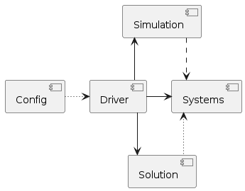

Fig. [28](#org22f12d1) shows a lower view of the abstractions, interfaces between classes and how they interact via their public methods. The inputs to the program may be given via a .yaml file or a python dictionary in memory. The starting point in the main file is the initialisation of the driver corresponding to the mathematical description to be solved (so far only the intrinsic modal is available, Eqs. \eqref{eq3:intrinsic_full_aeroelastic}). The intrinsic driver computes (or loads), as a pre-simulation step, the intrinsic modal shapes and nonlinear tensors from the linear stiffness and mass matrices and the nodal coordinates; then it runs the cases by triggering the simulation class. This class is responsible for managing how the systems are being run (in serial, in parallel, or even in a coupling process between systems). From the configuration settings, the intrinsic system loads the equations (dqs), the external loads in Eqs. \eqref{eq2:sol_qs}, such as point-forces, gravity or modal aerodynamic GAFs. Various libraries can be chosen to either solve the static equations or march in time if the solution is dynamic; importantly, the JAX-based Diffrax library has been integrated and supports ordinary, stochastic and controlled equations, with many solvers and multiple adjoint methods which could be used in an optimization framework. This initial layout of the software is expected to evolve and to be consolidated as the software matures. 

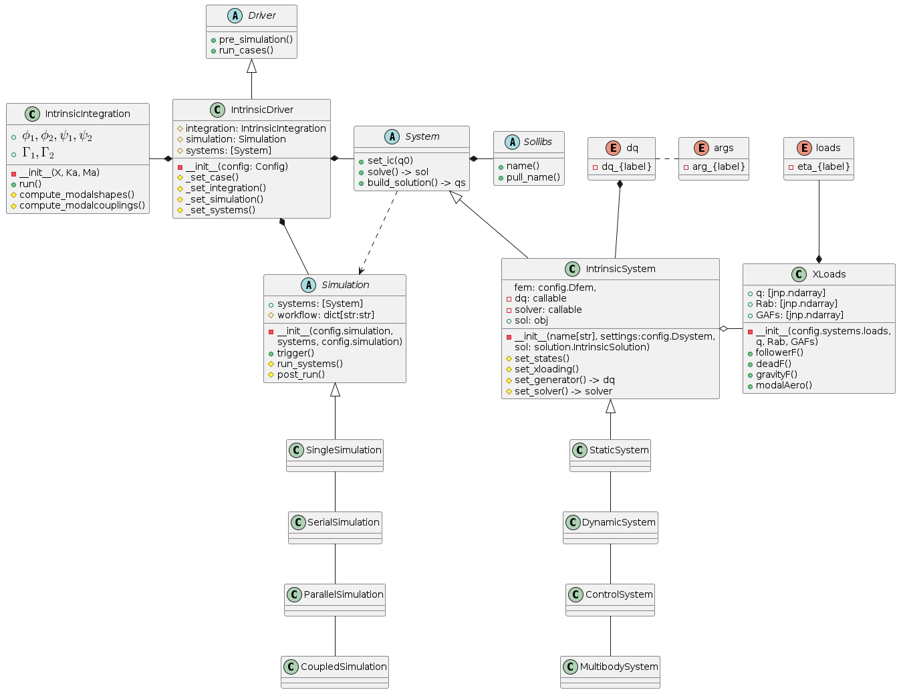

\newpage

# Examples

All the cases presented are part of a Test suite that has been built as a critical step for long term software management.
They serve as a demonstration of the approach's ability to deal with geometric nonlinearities, the accuracy of the solvers when compared to full FE simulations, and the computational gains that can be achieved. Table \ref{table:benchmarks} introduces the cases that are discussed below with the improvements in performance from the new implementation.
All computations are carried out on a single core of the same CPU, an i7-6700 with 3.4 GHz clock speed.
The old code based on Python was not optimised and made heavy use of for-loops instead of vectorised operations. These results convey the potential improvements in scientific software when paying attention to the implementation solely. Besides of this, it is also worth remarking the very short times in the solutions, which is also largely due to a formulation in modal space that naturally leads to reduced order models and easily caters for vectorised operations.
Six examples are presented, first three are static cases and the other three are dynamic cases with the last one being a time domain aeroelastic response to a gust.
The model complexity is also augmenting starting with beams to then move to a representative aircraft of medium complexity, the so-called Sail Plane, and finally considering an industrial-scale aircraft, the XRF1 model. Note the longer dynamic simulation of the Sail Plane wing compared to the XRF1 gust response: despite i.e. more operations in the solution time step, driven the largest eigenvalue in the solution, was much smaller in the Sail Plane results 

## Canonical cases

Structural static and dynamic cases of simple models undergoing very large deformations are shown in this section. Even though the models are simple,  the complexity here is found in the more challenging physics than a normal airplane undergoes in terms of geometric nonlinearities.

### Beams static response

Initially we consider a series of simple beam models that have been standard for the verification of geometrically nonlinear theories.
First a 2D problem of a straight cantilever under a follower tip force is shown in Fig. [33](#org199f49d). The structure is deformed into a hook undergoing very large deformations.
The beam properties are 100 cm length, cross-sectional area of 20 cm$^2$, $I=3/2$ cm$^4$, $E=2.1\times 10^7$ N/cm$^2$. The example first appeared in \cite{Argyris1981} but a finer discretisation with 25 nodes is used here, which explains the small differences.
This case, which consists of 7 different load increments, runs in the new implementation with the full set of modes (150) in 7.8 seconds and it used to run in almost 10 minutes, for a 75 times speed-up.

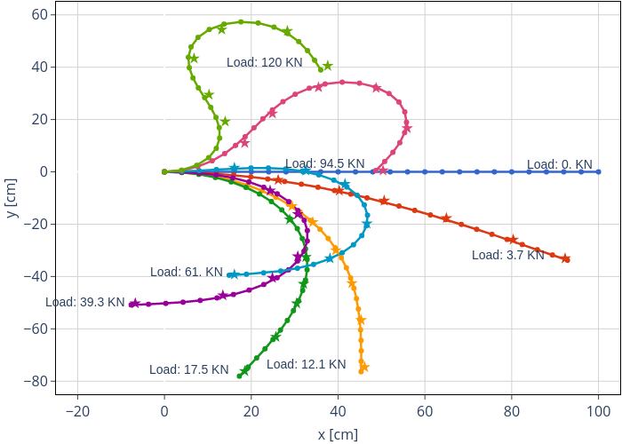

  
Next, a curved cantilever under static follower loads is shown in Fig. \ref{fig:simo45}.
It was first analysed  by Bathe and Bolourchi \cite{Bathe1979} and it has extensively been used to validate nonlinear structural implementations \cite{Simo1986a,Werter2016}.
It increments the complexity with respect to the previous example by undergoing very large deformations in 3D space.
The geometry consists of a 45-degree bend circle of 100 m radius, 1 m square cross section, Young’s modulus $E = 107$ Pa, and negligible Poisson ratio. A discretisation of 15 nodes with the full set of modes (90) are employed in the solution. This case runs in 7 seconds as opposed to the 2 minutes taken in the previous implementation. The difference is substantial but not as large as the previous case, where less modes were used in the solution. Also note previously Jacobians of the equations were being provided to the Newton-Raphson solvers, which are not (yet) implemented in the new solver.

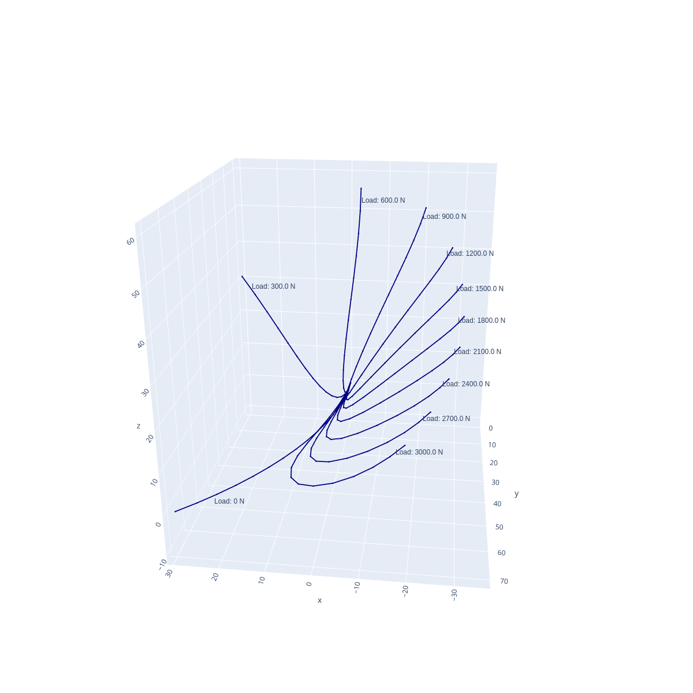

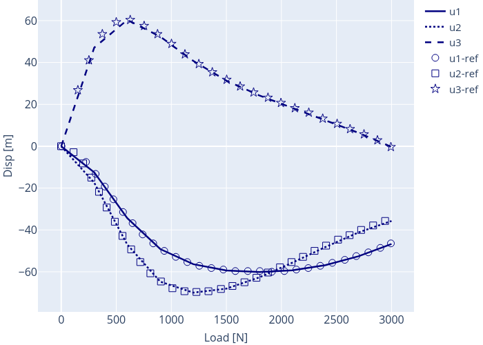

### Free vibrations of thin-walled cantilever

Next, we study the dynamic behaviour of a cantilever previously studied in \cite{PALACIOS2019} and shown in Fig. \ref{fig:cantilever}. 
Three equivalent models are built: 1) with beam elements and lumped masses, 2) shell elements with lumped inertia, and 3) shell elements with distributed inertia.
The material properties are $E = 106$ N/m$^2$, $v = 0.3$ and $\rho = 1$ Kg/m$^3$.
MSC Nastran 4-noded elements (CQUADs) are employed; mass properties are given either as density in the material cards  or as discrete mass elements (CONM2s) representing sectional inertia; and interpolation elements (RBE3s) which link the nodes in full and reduced models.
The differences between the shell and beam models, are shown as well as how those are captured by the current methodology in dynamical problems.

NMROMs are built from three linear models in MSC Nastran and a 30-node spanwise discretisation along the main load path is used for the model condensation using Guyan reduction. This was found to provide converged solution for the nonlinear response studied &#x2013;which surpassed 30$\%$ of displacements with respect to the cantilever length. 
The free-vibrations of the system are investigated by imposing an initial parabolic velocity distribution along the undeformed cantilever. A small excitation results in a linear response as shown in the displacements in y and z directions in Fig. \ref{fig:cantilever_sollinA}. Axial displacements are exactly zero. The lumped shell and beam models show identical response while the distributed mass model is slightly shifted with respect to them. Geometrically-nonlinear effects become relevant as the amplitude of the initial velocity is increased. Displacements over 35$\%$ are obtained as presented in the time history of the free-end displacements in Fig. \ref{fig:cantilever_sollinB}. Converged simulations are obtained with 85 modes and a time step of $\Delta t = 0.002$.  \textbf{The difference between previous and current implementations is nearly three orders of magnitude: 34.3 seconds versus 6 hours, 16 minutes and 53 seconds.}

## Structural verification of a representative configuration

\label{sec:representative_aircraft}
A representative FE model for aeroelastic analysis of a full aircraft without engines is used to demonstrate the capabilities of the current methodology on large finite-element models. The aircraft’s main wing is composed of wing surfaces, rear and front spars, wing box and ribs. Flexible tail and rear stabiliser are rigidly attached to the wing. Structural and aerodynamic models are shown in Fig. \ref{fig:SailPlane}. This is a good test case as it is not very complex yet has all the features for detailed aeroelastic analysis and it is available open source.  

### Geometrically nonlinear static response

The static equilibrium of the aircraft under prescribed loads is first studied with a NMROM built with the first 50 modes. Follower loads normal to the wing are applied at the tip of each wing. The response under loads of 200, 300, 400, 480 and 530 KN is shown in Fig. \ref{fig:sp_static}. Nonlinear static simulations on the original full model (before condensation) are also carried out in MSC Nastran and are included in the figure. The interpolation elements in Nastran are used to output the displacements at the condensation nodes for direct comparison with the NMROM results. To quantify the difference between both sets of results, tip displacements, in global coordinates, for the 530 KN load and the full model Nastran calculations are $u_x = -0.217$ m  $u_y = -1.348$ m, $u_z = 7.236$ m; while NMROM calculations yield $u_x = -0.219$ m  $u_y = -1.352$ m, $u_z = 7.249$ m. This represents an error of 0.19$\%$ for a 25.6$\%$ tip deformation of the wing semi-span, $b = 28.8$ m.

Geometric nonlinearities are better illustrated by representing a sectional view of the wing as in Fig. \ref{fig:sp_axial}. Deformations in the z-direction versus the metric $\sqrt{x^2+y^2}$ are shown in Fig. \ref{fig:sp_axial}(a) where MSC Nastran linear solutions are also introduced. This allows appreciating more clearly the shortening effect in nonlinear computations. On the other hand, the length of the main wing after reduction to the 1D domain is computed before and after deformations ($L_w = \int_{\Gamma_{w}} ds$). Because the resultant axial stiffness is much higher than bending or torsional stiffness, the structure is nearly inextensible. This effect, however, is not captured by linear approximations. Fig. \ref{fig:sp_axial}(b) shows the percentage change in the total length of the main wings with the driving set of forces. 

Excellent agreement is obtained between the nonlinear static calculations from MSC Nastran and those of the proposed approach. In terms of computational efficiency, \textbf{the new implementation has taken 8 seconds, while the full model in Nastran takes 5 minutes and 47 seconds.}
  
A first attempt into recovering the 3D structural response has been put in place with a very good agreement between the obtained configuration and Nastran 400 solution. A mapping between the aerodynamic model (surface of panels) and the condensed model is built using the positions and rotations from the solution; then an RBF kernel is placed at every corner of each of the panels, which deforms the 3D structural mesh. Fig. \ref{fig:sailplane3Dstatic} shows the overlap in the Nastran solution (in blue) and the NMROM (in red) for the 2000 and 5300 KN loadings. A similar but more realistic strategy is to use the nodes connected by the RBE3s elements instead of the aerodynamic panels as the interpolation points. Furthermore, the cross-sectional information from the 3D modal shapes could also be added if necessary. The accuracy of those will be assessed in future work but the current results already show the potential of this method to reproduce full 3D nonlinear solutions and, for instance, be able to couple the solvers to a CFD aerodynamic model for more accurate results on the aerodynamic side.   

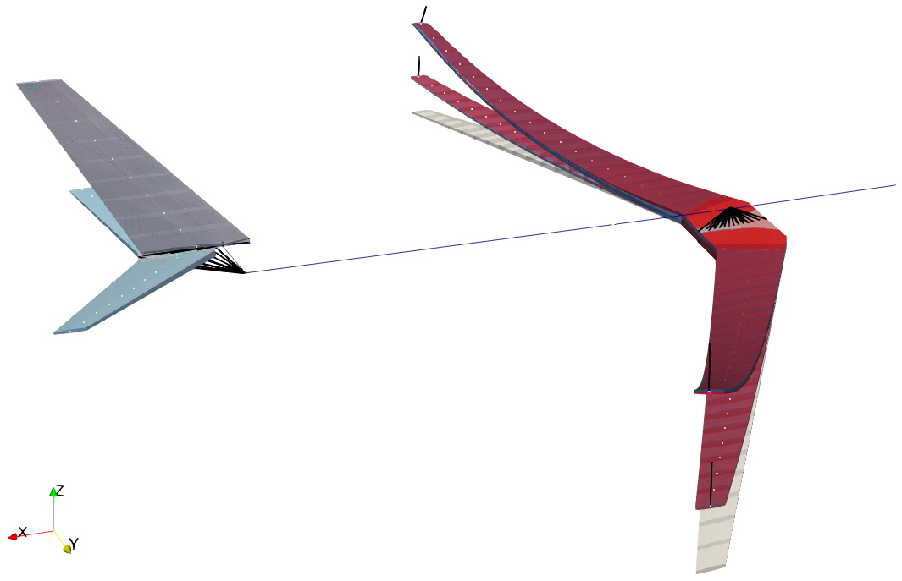

### Large-amplitude nonlinear dynamics

This test case demonstrates the accuracy of the NMROM approach for  dynamic geometrically-nonlinear calculations and was first introduced in <&CEA2021>. The right wing of Fig. \ref{fig:SailPlane} is considered and dynamic nonlinear simulations are carried out  and compared to MSC Nastran linear and nonlinear analysis (SOL 109 and 400, respectively) on the full FE model. A force is applied at the wing tip with a triangular loading profile, followed by a sudden release of the applied force to heavily excite the wing.

The dynamic response is presented in Fig. \ref{fig:sp_results}, where results have been normalised with the wing semi-span. As expected, linear analysis over predicts vertical displacements and does not capture displacements in the $x$ and $y$ directions. NMROMs were built with 15 and 50 modes. An impressive reduction of computational time is achieved in the new implementation that for the 50 modes case and with a small time step of 0.001 seconds takes \textbf{10.9 seconds} while the nonlinear response of the full model in \textbf{Nastran took 1 hour 22 minutes.}   

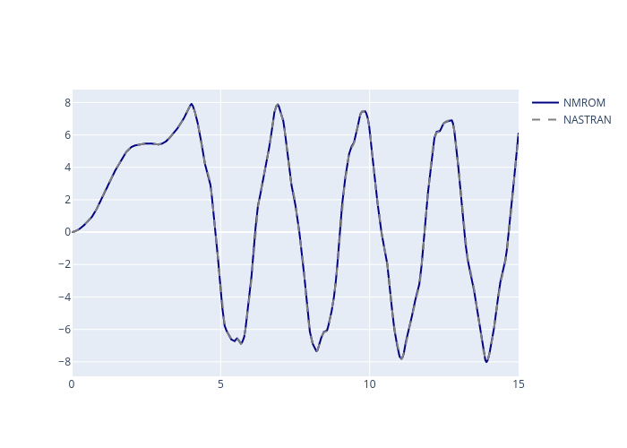

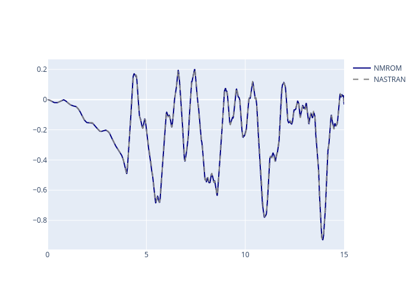

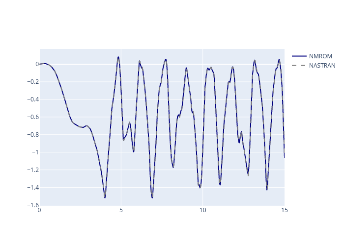

## Dynamic loads on an industrial configuration

The studies presented in this section are based on a reference configuration developed to industry standards by Airbus as part of the eXternal Research Forum (XRF), from which the aircraft takes its name, XRF1. The aircraft represents a long-range wide-body transport airplane  and has been used as a research platform for collaboration between the company, universities and research institutions. Fig. \ref{fig8:xrf1-model} shows the full aeroelastic model split up into the structural, mass and aerodynamic components. The FE model contains a total of around 177400 nodes, which are condensed into 176 active nodes along the reference load axes through interpolation elements. A Guyan or static condensation approach is used for the reduction. One of the strengths of the present methodology is that 
The aerodynamic model contains $\sim 1,500$ aerodynamic panels.

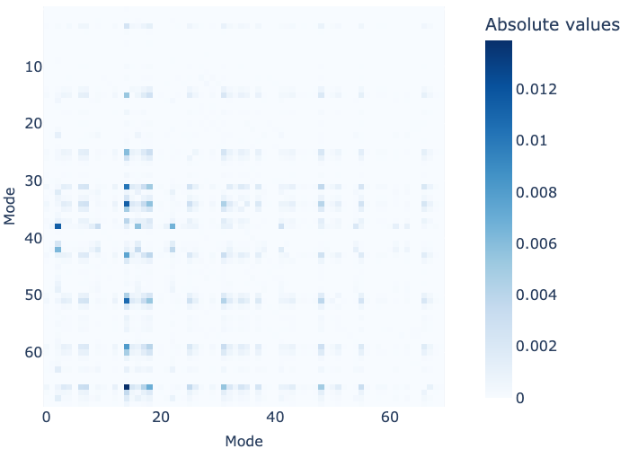

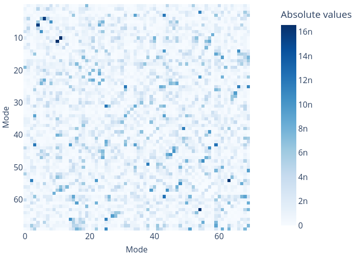

Fig. \ref{fig:gust001} shows the normalised tip response to a low  intensity 1-cos gust shape for a 0.81 Mach flow. A very good agreement is found with NASTRAN calculations based on the full FE model for this case with very small displacements, i.e. linear. On the other hand, a high intensity gust in Fig. \ref{fig:gust2} induces large deformations whose effects are only captured by the nonlinear solver. 

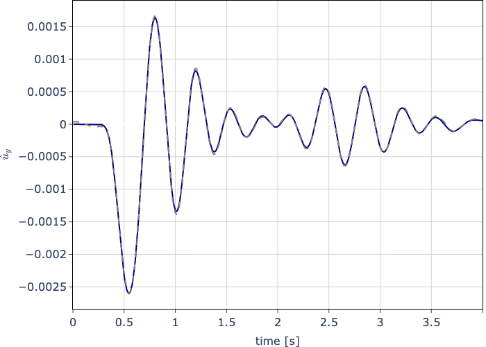

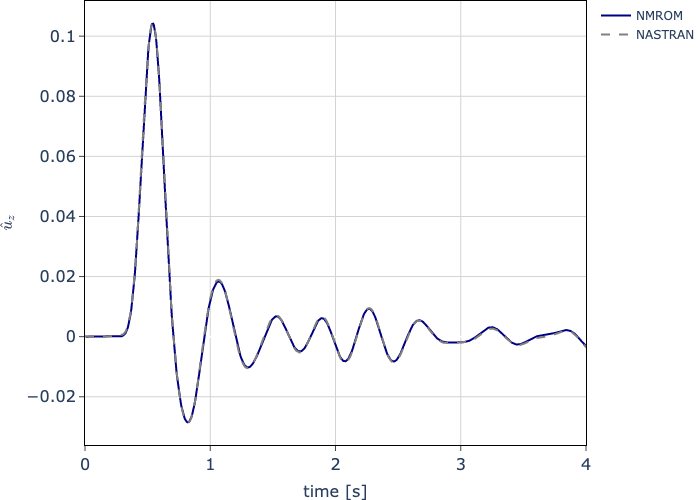

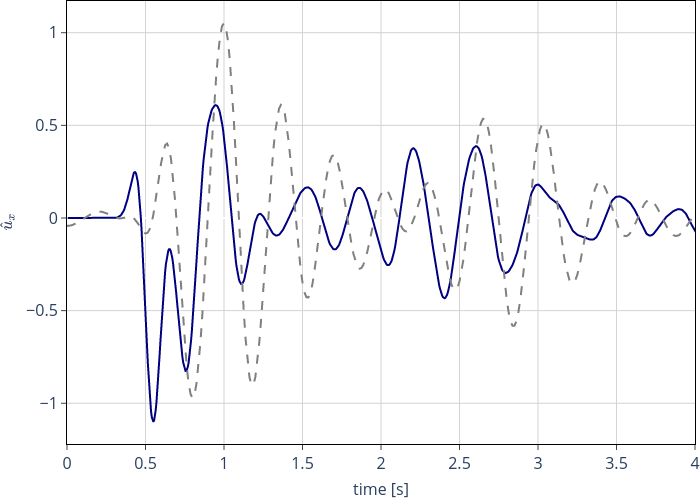

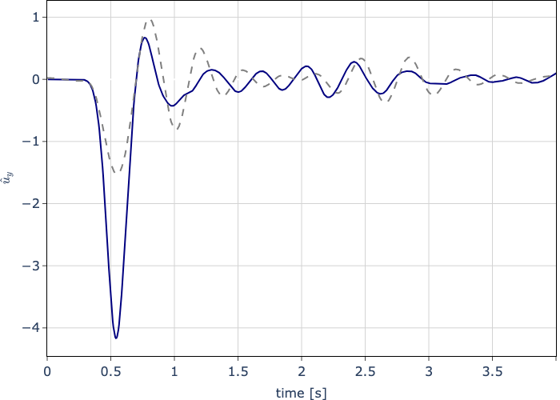

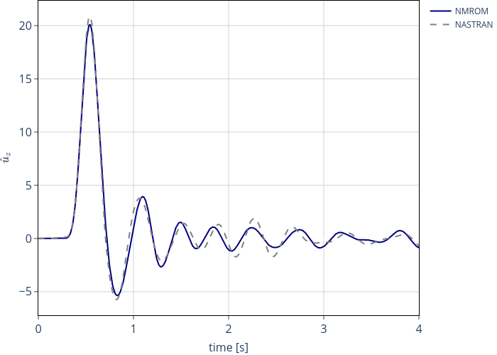

An important remark about these computations is that the gusts have been input in the reference configuration. Undergoing updates in the implementation aim to update the gust intensity at each panel with its normal component. This will account for the added nonlinearity of the changing in downwash.

# Conclusions

This paper has presented a modal-based description that incorporates geometrically nonlinear effects due to structural slenderness onto generic FE models initially built for linear analysis. 
While the underlying theory had already been introduced, a new implementation has been put in-place for both high-performance and software modularity, with the numerical library JAX as the engine powering the computations. 
Furthermore, a relevant amount of test cases accompany the software, of which a subset has been presented to illustrate the main capabilities that may range from a canonical beam undergoing extremely large deformations to a full-vehicle nonlinear aeroelastic response. A major highlight are the computational accelerations experimented which reach two orders of magnitude in dynamic analysis. This is due to the heavy use of vectorisation and just-in-time compilation.  
The ability to recover the full 3D state from the NMROM was also demonstrated and compared to the solution in NASTRAN.  
  
In the immediate future two objectives are foreseen with this implementation: first, a further assessment of the computational gains by running the examples presented here on GPUs; second and more important, the propagation of derivatives in the solution process via the Algorithmic Differentiation tool embedded in JAX. This will complete a fully differentiated aeroelastic framework that can run very efficient in modern software architectures while enhancing traditional FE models that can be very complex by construction but lack the physics of geometrically nonlinear effects. After that, increasing the fidelity in the load calculations to consider CFD-based aerodynamics would be an additional necessary step in order to achieve a more accurate nonlinear aeroelastic methodology. 

<~/Documents/Engineering.bib>

