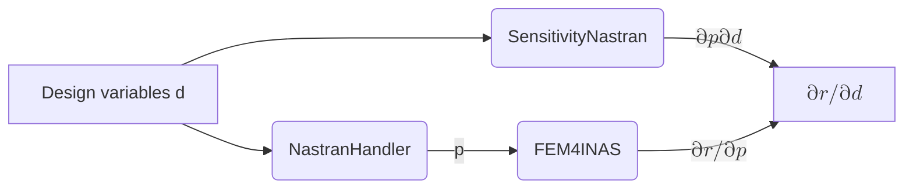
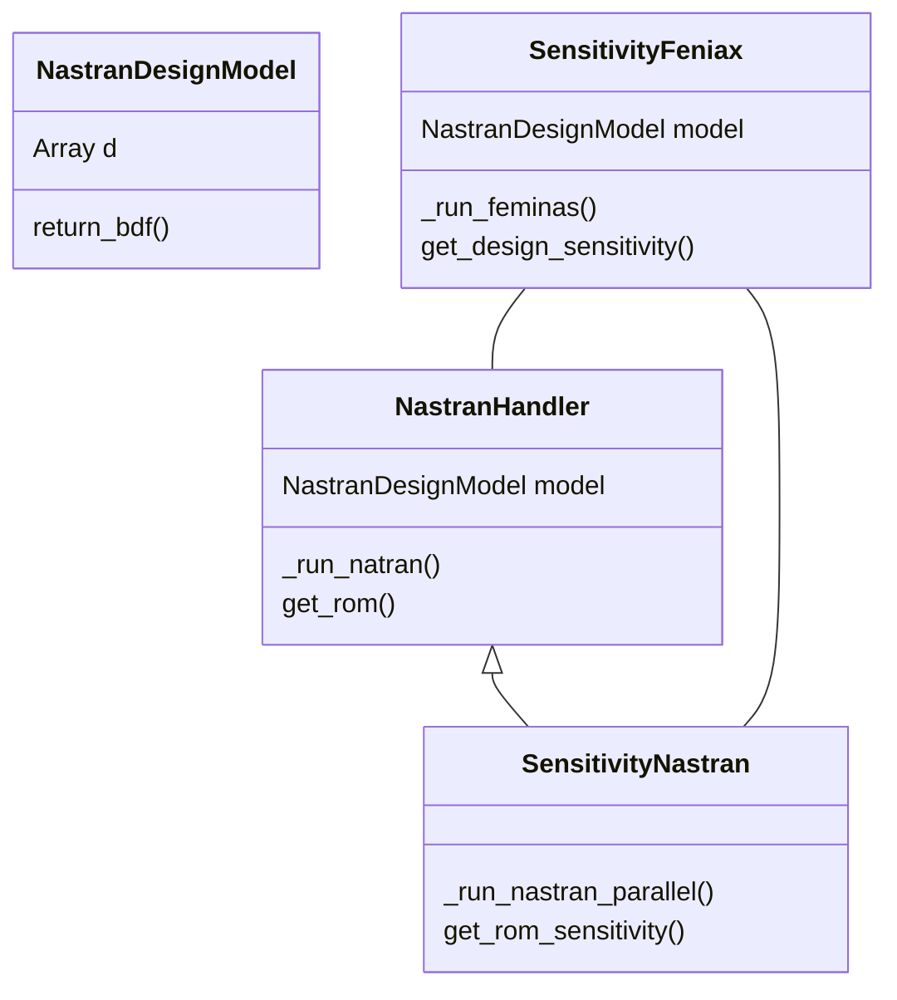

# FENIAX sensitivity analysis design doc

## Global variables

### NASTRAN_LOC

location of Nastran execution file

### Parameter (thickness)

Thickness ratios are interpolated using control point values

params : values at control points
coord : coordinates at control points
order : order of polynomial interpolation
